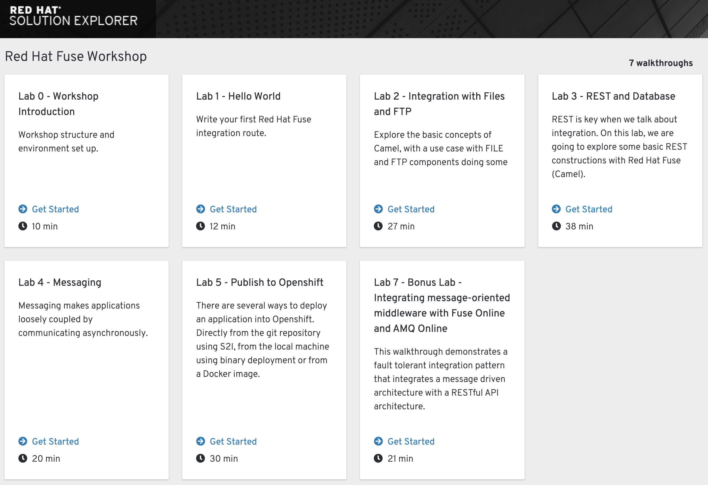

== Red Hat Fuse Workshop

This project is a sequence of hands-on labs to help people understand Red Hat Fuse based on the community project Apache Camel  in a hands-on approach.

This is focused on the Fuse with Spring Boot. But also have a few labs with Camel K and Fuse Online (Syndesis)

Those walkthroughs follow the structure to be deployed in the *Red Hat Integreatly* environment.

== Pre Requirements

=== Remote Environment (CodeReady Workspaces)

If you use CodeReady Workspaces, you just need a updated browser :) 
All the labs were tested only with Chrome, feel free to use any other 
and in case of any issue please https://github.com/hodrigohamalho/fuse-workshop-doc/issues[fill an issue].

== Local environment 

. Notebook (At least 4 GB RAM)
. JDK 1.8+
. Git
. https://www.okd.io/download.html[oc client (Openshift Command Line)]
. https://code.visualstudio.com/download[Visual Studio Code]
.. Plugin: https://marketplace.visualstudio.com/items?itemName=redhat.apache-camel-extension-pack[Extension Pack for Apache Camel]
. https://filezilla-project.org/download.php?type=client[Filezila (Optional)]

== Agenda

|===
| Time | Activity

| 8:00-9:00
| Registration and breakfast

| 9:00-10:00
| An introduction to agile integration concepts, use cases, and roadmap 

| 10:00-11:00
| Hands on demo

| 11:00-11:15
| Break

| 11:15-13:00
| **Labs**

    * Project-setup

    * Hello-router

    * Files-ftp

    * Rest-database

| 13:00-14:00
| Lunch

| 14:00-16:30
| **Lab:** 

    * Messaging

    * OpenShift

    * Fuse AMQ Online

| 16:30-17:00
| Recap and summary
|===

== Lab structure 

All the labs uses the https://github.com/hodrigohamalho/fuse-workshop[Fuse-workshop project skeleton].

So just to warm up your machine clone https://github.com/hodrigohamalho/fuse-workshop[the project] and do a `mvn package`.

== Setup in Integreatly Environment 

. Login as admin in your OpenShift cluster
. Add this repository to your walkthrough catalog

    oc patch webapp tutorial-web-app-operator --type=merge -o yaml -p '{ "spec": { "template": { "parameters": { "WALKTHROUGH_LOCATIONS": "https://github.com/integr8ly/tutorial-web-app-walkthroughs.git#master,https://github.com/hodrigohamalho/fuse-springboot-workshop.git#master" }}}}' -n webapp

Now, you must see those walkthrough sessions in initial page.

