:walkthrough: Setup Codeready workspace with Fuse
:codeready-url: https://codeready-codeready.{openshift-app-host}
:openshift-url: {openshift-host}/console
:next-lab-url: https://tutorial-web-app-webapp.{openshift-app-host}/tutorial/fuse-springboot-workshop.git-walkthroughs-01-hello-router
:user-password: Abt7MjWMb8v4ECS

endif::[]

= Lab 0 - Workshop Introduction

Workshop structure and environment set up.

Welcome to the Fuse workshop! It's a pleasure to guide you on this hands-on experience. 

This workshop has as target to offer you a pratical experience with Red Hat Fuse, it's not a complete training 
of Red Hat Fuse, for this purpose we have an amazing https://www.redhat.com/pt-br/services/training/jb421-red-hat-jboss-fuse-camel-development[official training] 
covery many aspects of Red Hat Fuse in deep.

As the objective is not cover all details and cover many Fuse aspects during this workshop, 
we will be using a https://github.com/hodrigohamalho/fuse-workshop.git[project skeleton] during this lab.

This project called *fuse-workshop* project is a Red Hat Fuse (aka Camel) Spring Boot project, 
with some code already did for you, it will provide help to make you focused in the what really matters 
instead of boilerplate code.

[type=walkthroughResource]
.CodeReady Workspaces
****
* link:{codeready-url}[Console, window="_blank"]
****

****
* link:https://developers.redhat.com/products/codeready-workspaces/overview/[Want to know more about Openshift CodeReady Workspace ?, window="_blank"]
****

[type=walkthroughResource]
.OpenShift Console
****
* link:{openshift-url}[Console, window="_blank"]
****

.Fuse
****
* link:https://launch.openshift.io[Create new projects using Launcher, window="_blank"]
****

Lab Requirements

. Cloud
.. Web Browser

. Local machine
.. Notebook (At least 4 GB RAM)
.. JDK 1.8+
.. Git
.. https://www.okd.io/download.html[oc client (Openshift Command Line)]
.. https://code.visualstudio.com/download[Visual Studio Code]
... Plugin: https://marketplace.visualstudio.com/items?itemName=redhat.apache-camel-extension-pack[Extension Pack for Apache Camel]
.. https://filezilla-project.org/download.php?type=client[Filezila (Optional)]

{empty} +

Knowledge Requirements 

. Java
. Maven
.. Replace your `~/.m2/settings.xml by the fuse-workshop/configuration/settings.xml`

== Setup Code Ready Workspace

These walkthrough use Code Ready Workspace (Eclipse Che). 
It's an IDE on the cloud, but I recommend you to set up a local environment because it's usually what the most developers use on a daily routine. 

. It's not mandatory  you can use your preferred IDE, like Visual Studio Code or JBoss Developer Studio.

To build the project in your own environment, you will need:

* JDK 7+
* Maven 3+
* Git 

If you already have all installed, just clone the git repository and run mvn install

[source,bash]
----
git clone https://github.com/hodrigohamalho/fuse-workshop.git
cd fuse-workshop
mvn spring-boot:run
----

The *fuse-workshop* project is a Camel Spring Boot project, 
with some boilerplate code already did for you, it will provide help to make you 
focused in the what really matters instead of boilerplate code.

{empty} +

.Open link:{codeready-url}[CodeReady Workspaces, window="_blank"]

Credentials:

Your username is: `{user-username}` +
Your password is: `{user-password}`

{empty} +

.. Create the workspace (Maybe this step happens automatically for you)

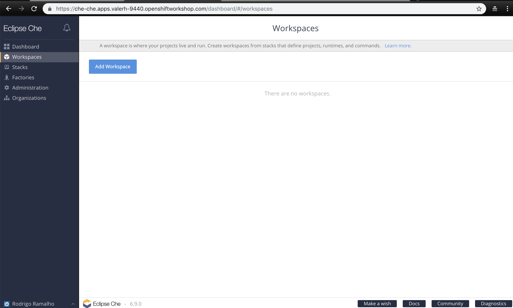

{empty} +

... In the *Stack* options, choose *Red Hat Fuse stack*
... Change the *RAM* memory to *4 GBs*.
... Click on *Add or import project*
... Repository URL: `https://github.com/hodrigohamalho/fuse-workshop.git`
... Click on *Create*
... Create the workspace and select the option *Open IDE*

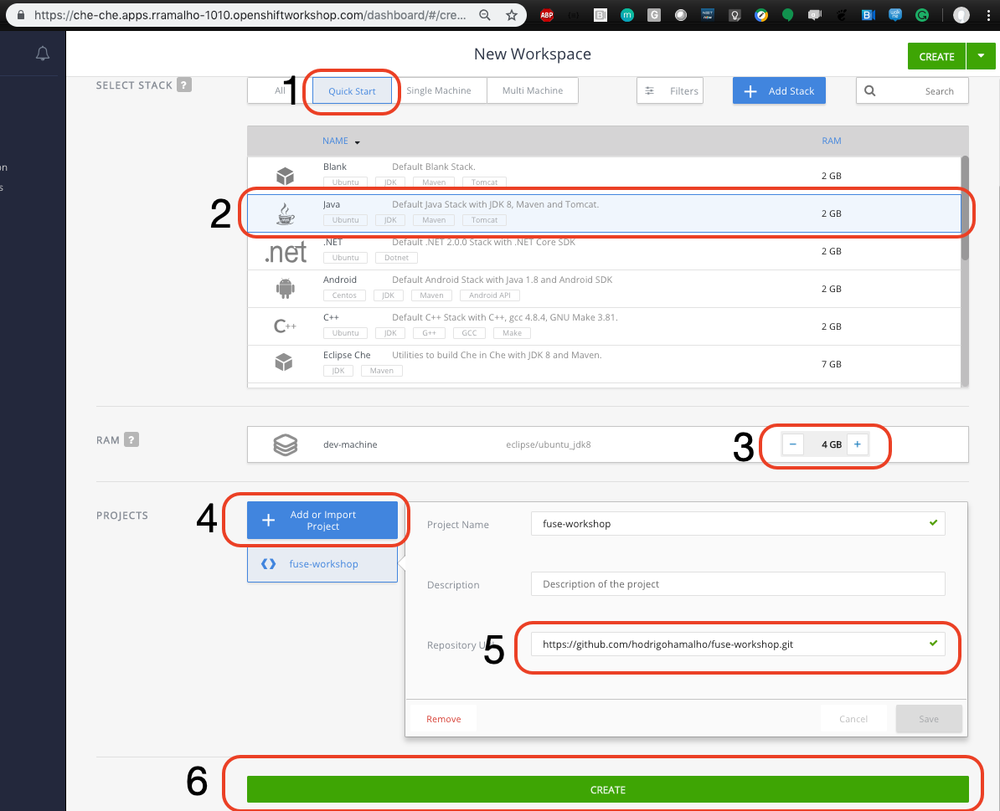

{empty} +

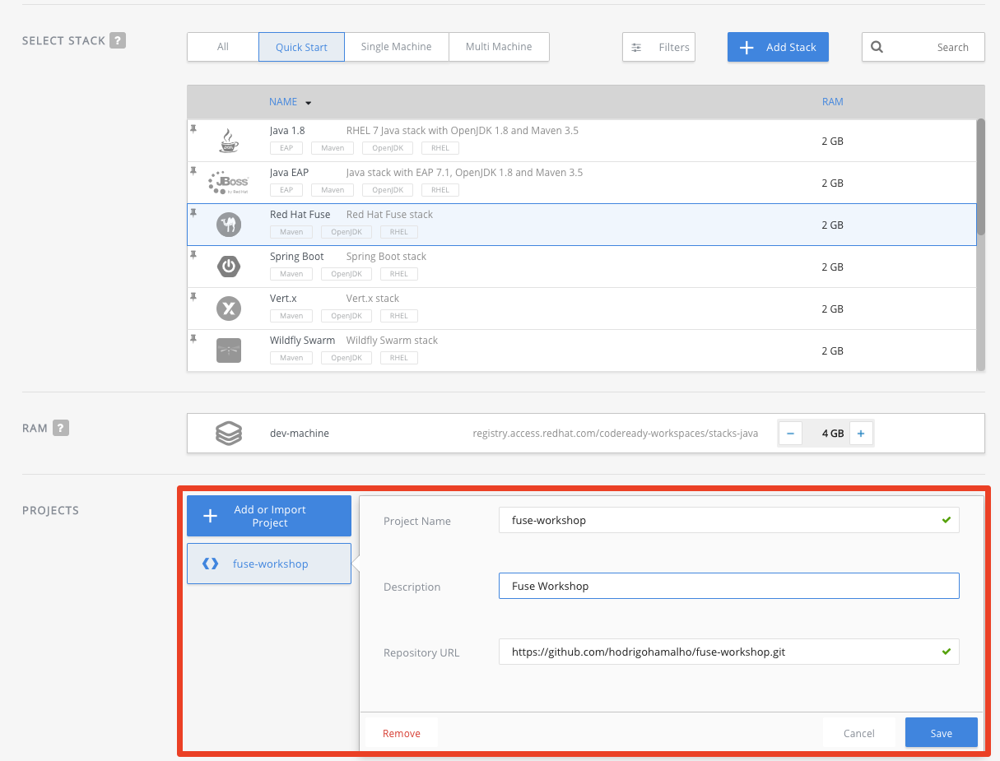

{empty} +

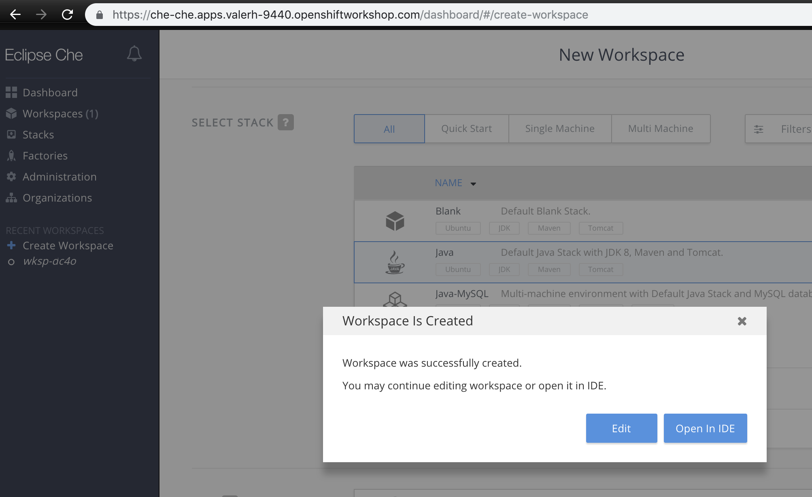

{empty} +

As you are executing this for the first time, all dependencies will be downloaded and it takes time, please be patient.

{empty} +

If everything worked fine, you now are seeing an IDE with your project imported.

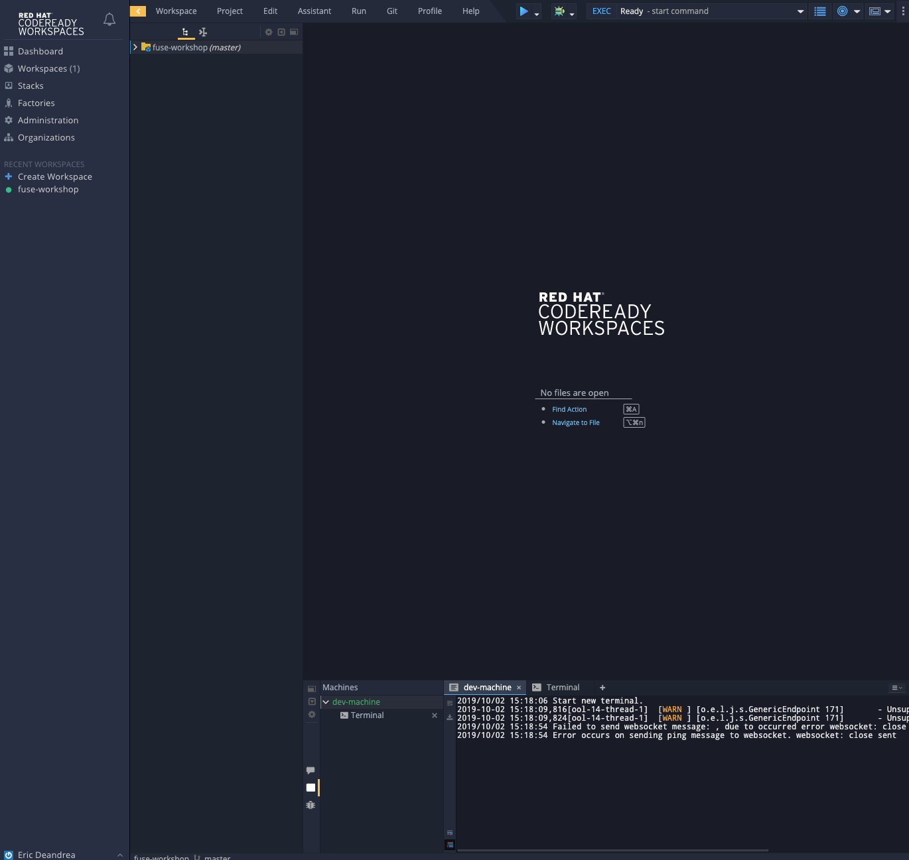

In the next step we are going to configure this project properly.

{empty} +

[time=10]
== Setup Project

. Let's inform to Eclipse Che that it is a Maven project.

.. Select the project and on the *top menu*, select *Project > Update Project Configuration*.

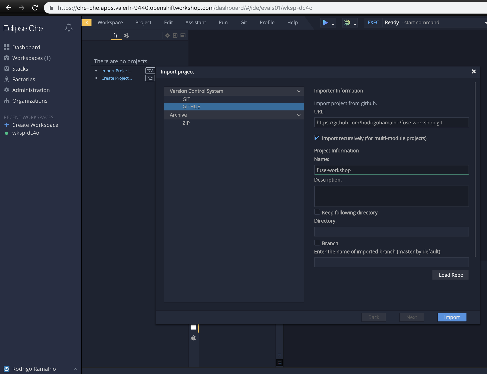

{empty} +

.. In the *Project Configuration* panel, under the menu *Java* select *Maven* as the option and *Save*.

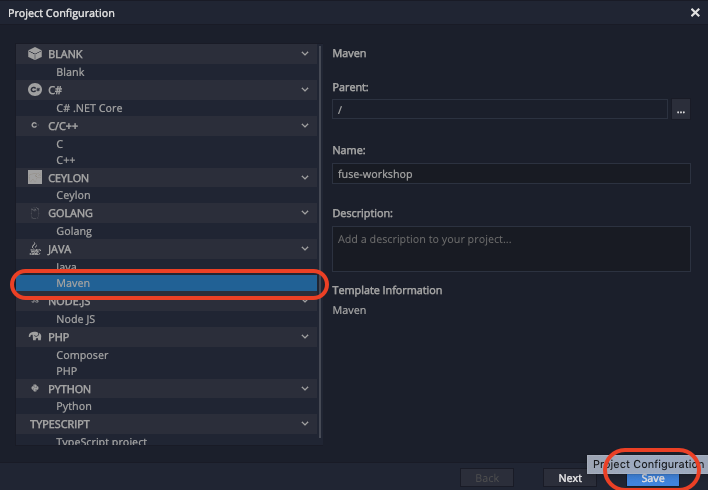

{empty} +

.. Select Next in the panel that shows maven configuration.

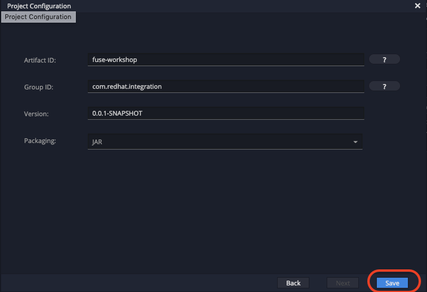

{empty} +

If everything worked fine, you should see a screen similar with this one

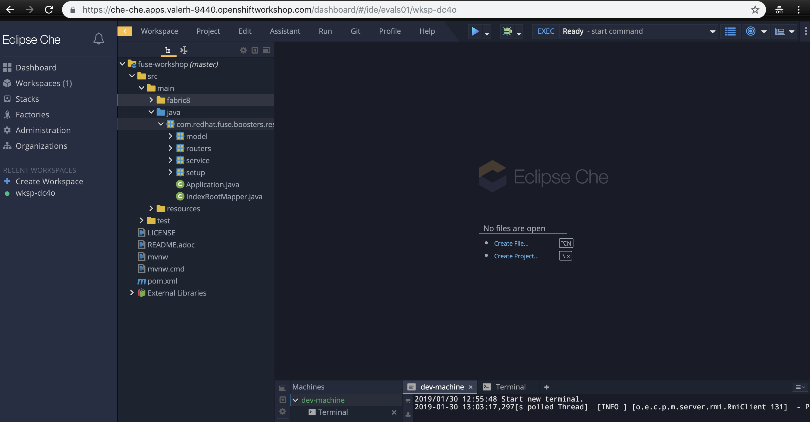

{empty} +

.. Click on the arrow next to the *PLAY* button, and select *Create Run Command*
... Name: run 
... Command line:

    mvn spring-boot:run -f ${current.project.path}

... Select apply to *fuse-workshop*
... Click on the green button *RUN* 

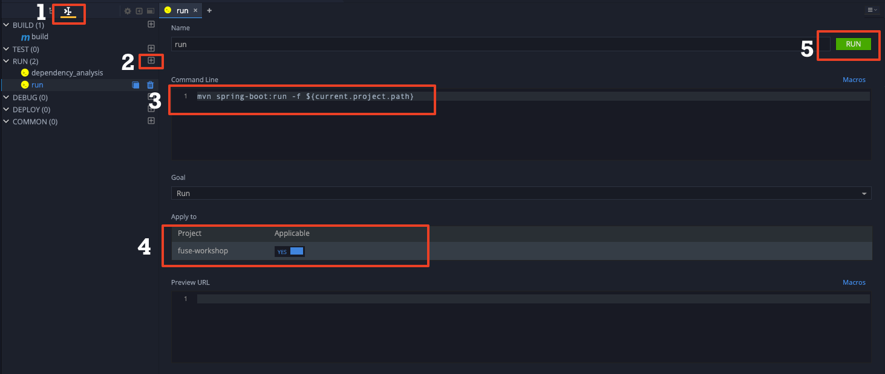

After run you should see "Hello router" message in the console.

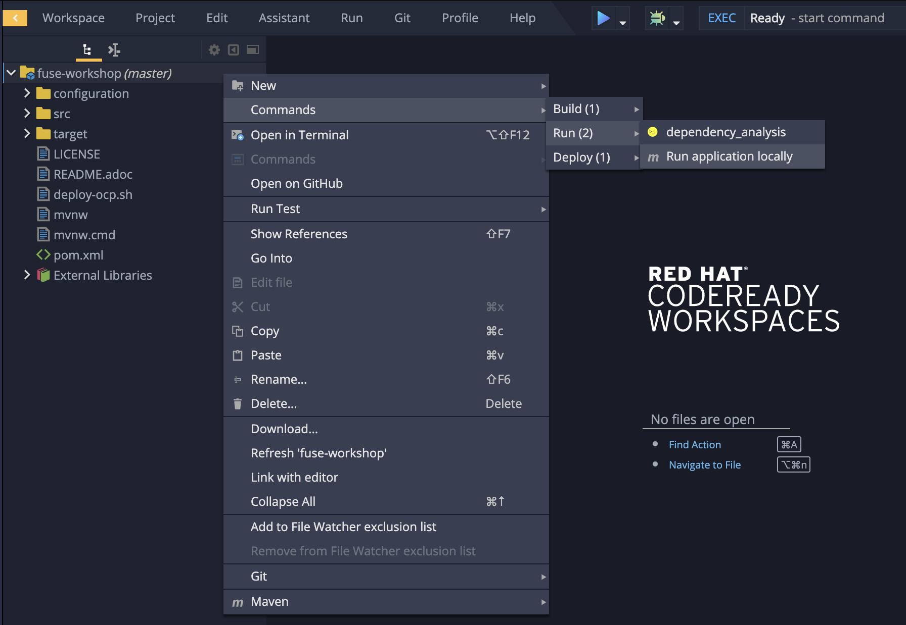

[time=10]
[type=verification]
Are you seeing a loop hello message in the logs?

During the workshop you will do several changes in the source code, so to redeploy 
just hit the *Re-run* button.

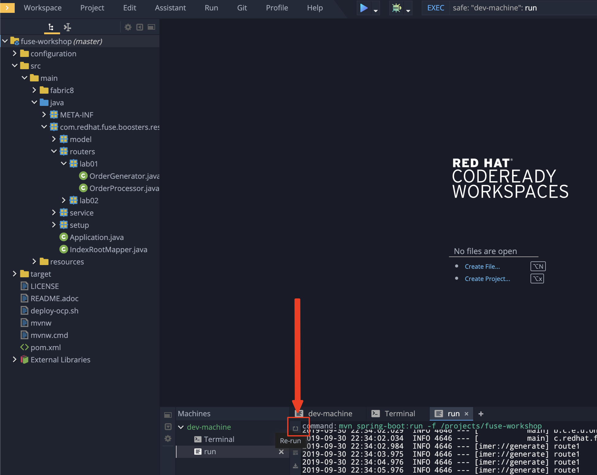

[time=1]
== Summary 

Congratulations you finished the setup of your environment! 

On this lab, you learned how to set up a Fuse on Springboot project using Code Ready Workspace.

You can now proceed to link:{next-lab-url}[Hello Router Lab].
