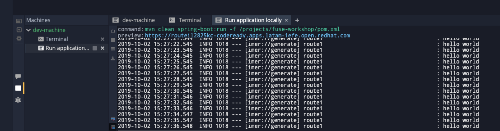

:walkthrough: Setup Codeready workspaces with Fuse
:codeready-url: https://codeready-codeready.{openshift-app-host}
:openshift-url: {openshift-host}/console
:next-lab-url: https://tutorial-web-app-webapp.{openshift-app-host}/tutorial/fuse-springboot-workshop.git-walkthroughs-01-hello-router
:user-password: Abt7MjWMb8v4ECS

endif::[]

= Lab 0 - Workshop Introduction

Workshop structure and environment set up.

Welcome to the Fuse workshop! It's a pleasure to guide you on this hands-on experience.

This workshop aims to offer you practical experience with Red Hat Fuse. It is not meant to be a complete training of Red Hat Fuse. For this purpose we have an amazing https://www.redhat.com/pt-br/services/training/jb421-red-hat-jboss-fuse-camel-development[official training], covering many aspects of Red Hat Fuse in depth.

The main objective is to cover as many Fuse aspects during this workshop. We will be using a https://github.com/hodrigohamalho/fuse-workshop.git[project skeleton] during this lab.

This *fuse-workshop* project is a Red Hat Fuse (aka https://camel.apache.org[Apache Camel]) Spring Boot project, with some code already written for you. It will help you focus on what really matters rather than having you write lots of boilerplate code.

[type=walkthroughResource]
.CodeReady Workspaces
****
* link:{codeready-url}[Console, window="_blank"]
****

link:https://developers.redhat.com/products/codeready-workspaces/overview/[Want to know more about CodeReady Workspaces?, window="_blank"]

[type=walkthroughResource]
.OpenShift Console
****
* link:{openshift-url}[Console, window="_blank"]
****

.Fuse
****
* link:https://launch.openshift.io[Create new projects using Launcher, window="_blank"]
****

Lab Requirements

. Cloud
.. Web Browser

. Local machine
.. At least 4 GB RAM
.. JDK 1.8+
.. Git
.. oc client
... https://access.redhat.com/downloads/content/290[Download from Red Hat]
... https://www.okd.io/download.html[Download from Community]
.. https://visualstudio.microsoft.com/downloads/[Visual Studio IDE]
... Plugin: *Extension Pack for Apache Camel*
... Plugin: *Language Support for Apache Camel*
.. https://filezilla-project.org/download.php?type=client[Filezila]

Knowledge Requirements

. Java
. Maven
.. Replace your `~/.m2/settings.xml` by the `fuse-workshop/configuration/settings.xml`

[time=5]
== Setup Code Ready Workspace

These walkthrough use CodeReady Workspaces (based on https://www.eclipse.org/che[Eclipse Che]).
It's an IDE on the cloud based on containers. You can also use a local development environment if you'd prefer (i.e. https://code.visualstudio.com[Visual Studio Code], https://developers.redhat.com/products/codeready-studio/overview[Red Hat CodeReady Studio] (formerly known as JBoss Developer Studio), https://www.jetbrains.com/idea[IntelliJ IDEA], etc).

To build the project in your own environment, you will need:

* JDK 7+
* Maven 3+
* Git

If you already have all installed, just clone the git repository and run `mvn install`

[source,bash]
----
git clone https://github.com/hodrigohamalho/fuse-workshop.git
cd fuse-workshop
mvn spring-boot:run
----

The *fuse-workshop* project is a Camel Spring Boot project, with some code already written for you. It will help you focus on what really matters rather than having you write lots of boilerplate code.

{empty} +

.Open link:{codeready-url}/f?url=https://github.com/hodrigohamalho/fuse-workshop[CodeReady Workspaces, window="_blank"]

Credentials:

Your username is: `{user-username}` +
Your password is: `{user-password}`

{empty} +

If everything worked fine, you should now see an IDE with your project imported.

image::images/05-che.png[eclipse che, role="integr8ly-img-responsive"]

In the next step we are going to configure this project properly.

{empty} +

[time=5]
== Setup Project

Run Project

. Right-click on the `fuse-workshop (master)` project & select `Commands -> Run (2) -> Run application locally`
. You should see the application build and then run

[time=5]
[type=verification]
Are you seeing a loop hello message in the logs?

During the workshop you will do several changes in the source code, so to redeploy
just hit the *Re-run* button.

image::images/12-che.png[initial web page, role="integr8ly-img-responsive"]

[time=1]
== Summary

Congratulations you finished the setup of your environment!

In this lab, you learned how to set up a Fuse on Spring Boot project using CodeReady Workspaces.

You can now proceed to link:{next-lab-url}[Hello Router Lab].
