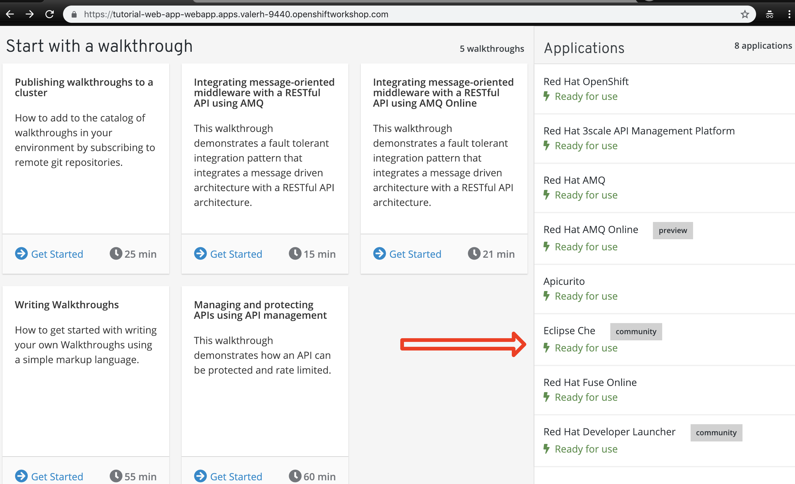
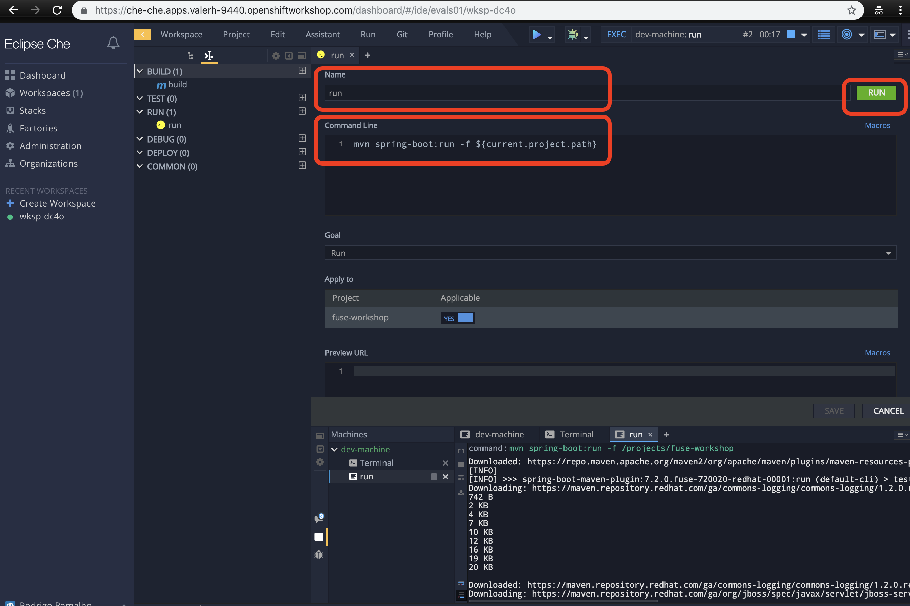

= 00 - Project Setup

Setup of the project using Eclipse Che for developing the other tasks. 

These tasks use Eclipse Che. It's not mandatory  you can use your preferred IDE, like Visual Studio Code, JBoss Developer Studio or IntelliJ.

To build the project in your own environment, you will need:

* JDK 7+
* Maven 3+
* Git 

If you already have all installed, just clone the git repository and run mvn install

    git clone https://github.com/hodrigohamalho/fuse-workshop.git
    cd fuse-workshop
    mvn spring-boot:run

The *fuse-workshop* project is a Camel Spring Boot project, 
with some code already did for you, it will provide help to make you 
focused in the what really matters instead of boilerplate code.

[type=walkthroughResource]
.Fuse
****
* link:https://launch.openshift.io[Create projects using Launcher link, window="_blank"]
****
.Camel Components
****
* link:https://github.com/apache/camel/blob/master/components/readme.adoc[Camel components link, window="_blank"]
****

== Setup Eclipse Che

{empty} +

. Provision Eclipse Che environment

.. Open the initial page {openshift-app-host} and Open *Eclipse Che* in the side menu.

{empty} +

.. Create the workspace (Maybe this step happens automatically for you)

image::images/02-che.png[initial web page, role="integr8ly-img-responsive"]

{empty} +

... In the *Stack* options, choose *"Java" - "Default Java Stack with JDK 8, Maven and Tomcat."*
... Change the *RAM* memory to *4 GBs*.
... Create the workspace and select the option *Open IDE*

image::images/03-che.png[initial web page, role="integr8ly-img-responsive"]

image::images/04-che.png[initial web page, role="integr8ly-img-responsive"]

{empty} +

As you are executing this for the first time, all dependencies will be downloaded and it takes time, please be patient.

{empty} +

If everything worked fine, you now are seeing an IDE opened without any project.

image::images/05-che.png[eclipse che, role="integr8ly-img-responsive"]

{empty} +

[time=10]

== Setup Project

. Import a maven project

.. In Che IDE, select *import project* > *Github* and fill the URL parameter with:

    https://github.com/hodrigohamalho/fuse-workshop.git

image::images/06-che.png[initial web page, role="integr8ly-img-responsive"]

{empty} +

.. In project configuration Choose *Java > Maven*

image::images/07-che.png[initial web page, role="integr8ly-img-responsive"]

{empty} +

 If everything worked fine, you should see a screen similar with this one

image::images/08-che.png[initial web page, role="integr8ly-img-responsive"]

{empty} +

.. Click on the arrow next to the *PLAY* button, and select *Create Run Command*
... Name: run 
... Command line:

    mvn spring-boot:run -f ${current.project.path}

... Select apply to *fuse-workshop*

image::images/09-che.png[initial web page, role="integr8ly-img-responsive"]

{empty} +

[time=5]

. Run Project
.. Click on the green button *RUN* 

[time=5]

[type=verification]
Are you seeing a loop hello message in the logs?

