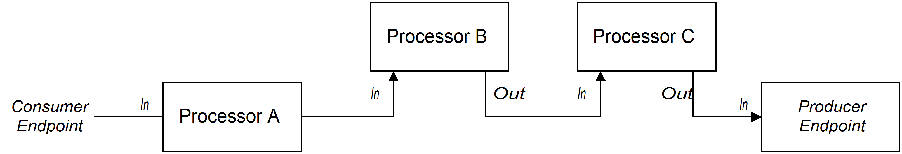

= 01 - Hello Router

Creating your first Camel router.

[type=walkthroughResource]
.Camel Components
****
* link:https://github.com/apache/camel/blob/master/components/readme.adoc[Check components list, window="_blank"]
****

[time=2]
== Writing your first Camel Router

Using the project *fuse-workshop*, open the class *OrderGenerator.java*. 
If you are having trouble to find it, look in *src/main/java/com/redhat/fuse/booster/rest/routers/lab01* folder.

As you can see, this class is a very simple Camel Router already defined to you. A Camel Router is basically a class that extends RouteBuilder and implements the configure method.  
Let's focus on the code that really matters at the moment

    from("timer:generateOrder")
        .log("Hello router!");

This code is using the timer component, with all default configurations, it will be executed in a period of time 
forever the message *Hello router!"* in the console.

Components are the key of Camel, it's reusable components that abstract complex operations making it trivial, so 
it boosts your productivity!

https://github.com/apache/camel/blob/master/components/readme.adoc[Take a look in camel components]

[time=2]
== Timer component  

Let's use some parameters with timer component to repeat *only 5 times* within the *interval of 1 sec*. 

    from("timer:generateOrder?repeatCount=5&period=1000")
        .log("Hello router!"); 

image::../../images/camel-structure.png[]

This is the basic of a component usage. The component name (some examples: *file, ftp, http*), after we have the component 
name and for last the parameters supported by the documentation. 

If you configured your IDE correctly you should have auto complete working for it. 

Now, let's run the project clicking on the RUN action that we previously set up and see if it works.

If you are doing it locally, you can run as a standard spring-boot application.

    mvn spring-boot:run

[time=5]
== Generating Orders Automatically 

Now, take a look in the class *OrderService.java*, it generates an *Order.java* object, alternating some 
 values between *Camel* and *ActiveMQ*.

Let's call this method to get a new Order using a the *bean* method. 

    from("timer:generate?period=1000&repeatCount=5")
        .log("Generating Order...")
        .bean(OrderService.class, "generateOrder")
        .log("Order ${body.item} generated");

Now, it is using the OrderService class to generate a new Order, print some information in the console.

And... Where is the Order object? 

If your answer was in the body, you are right! 

Think in camel as a pipeline, that transport things *from* someplace to *another one*, and this message is in the body. Take a look in the log that accesses the item attribute inside the Order object, and the Order is the body itself. 

Take some time and take a look on https://access.redhat.com/documentation/en-us/red_hat_jboss_fuse/6.3/html/apache_camel_development_guide/basicprinciples[this documentation] to understand better how the camel pipeline works. 

