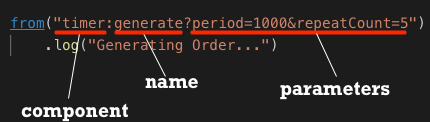

:walkthrough: Hello World Camel
:codeready-url: https://codeready-codeready.{openshift-app-host}
:openshift-url: {openshift-host}/console
:next-lab-url: https://tutorial-web-app-webapp.{openshift-app-host}/tutorial/fuse-springboot-workshop.git-walkthroughs-02-files-ftp

= Lab 1 - Hello World Camel

Write your first Red Hat Fuse integration route!

Let's explore a simple scenario where we are going to use a timer component to generate Orders automatically.

[type=walkthroughResource,serviceName=codeready]
.CodeReady Workspaces
****
* link:{codeready-url}[Console, window="_blank"]
* link:https://developers.redhat.com/products/codeready-workspaces/overview/[Want to know more about CodeReady Workspaces?, window="_blank"]
****

[type=walkthroughResource,serviceName=openshift]
.OpenShift Console
****
* link:{openshift-url}[Console, window="_blank"]
****

[type=walkthroughResource]
.Camel Components
****
* link:https://github.com/apache/camel/blob/master/components/readme.adoc[Camel components list, window="_blank"]
****

[time=2]
== Timer component

Using the *fuse-workshop* project, open the class `OrderGenerator.java`. You can use the project navigation to it, or use the short key `CTRL + P` or `CMD + P` and type `OrderGenerator`.
If you are having trouble finding it, look in `src/main/java/com/redhat/fuse/booster/rest/routers/lab01` folder.

image::./images/open-class.gif[]

{empty} +

As you can see, this is a very simple Camel Router already defined for you. A Camel Router is a class that extends `RouteBuilder` and implements the configure method. Let's focus on the code that really matters at the moment.

[source,java]
----
from("timer:generate")
  .log("Hello router!");
----

This code is using the timer component, with all default configurations, it will be executed in a forever the message *Hello router!"* in the console in a specific frequency.

Components are the key of Camel. They are flexible and reusable  "libraries" that abstract complex operations making it trivial, boosting developer productivity!

https://camel.apache.org/components/latest[Take a look at the camel components, window="_blank"]

Now, let's use some parameters with timer component to repeat *only 5 times* within the *interval of 1 sec*.

[source,java]
----
from("timer:generate?repeatCount=5&period=1000")
    .log("Hello router!");
----

Use *CTRL* + *SPACE* to use the auto complete feature, if it is available.

image::./images/codeready-autocomplete.gif[]

{empty} +

This is the basis of how components work.

Now, `Run` the project, if it's already running stop it closing the terminal tab and click on `Run`.

If you are doing it locally, you can run as a standard spring-boot application.

    mvn spring-boot:run

[type=verification]
Do you see 5 *Hello router!* messages on the console?

Think of Camel as a pipeline that transports things *from* someplace to *another one*, and this message body flows through the pipes.

Camel’s syntax is inspired by the UNIX pipeline. In UNIX, we might execute something like `ps -fe | grep foo`. When we run this command, the output of the `ps` command becomes the input to the `grep` command. We “pipe” the output of one command into the input of another command.

Camel chains these actions together in an object called an `Exchange`, which consists of an input message (called the “In” message), some sort of processor (like a component, for instance) and possibly an output or “Out” message if the processor is meant to provide a synchronous response.

A series of `Exchange` state changes creates a Camel Route.

image:./images/camel-pipeline.png[]

Take some time and take a look at https://access.redhat.com/documentation/en-us/red_hat_fuse/7.4/html/apache_camel_development_guide/basicprinciples[this documentation] to understand better how the Camel pipeline works.

[time=10]
== Generating Orders Automatically

Now, take a look in the class `OrderService.java`, it generates an `Order.java` object, alternating some values between *Camel* and *ActiveMQ*.

Let's call this method to get a new Order using the *bean* method.

[source,java]
----
from("timer:generate?repeatCount=5&period=1000")
    .log("Generating Order...")
    .bean(OrderService.class, "generateOrder")
    .log("Order ${body.item} generated");
----

Now, it is using the `OrderService` class to generate a new `Order`, print some information in the console.

And... Where is the Order object?

If your answer was in the body, you are right!

[type=verification]
Do you see different Orders by the messages on the console?

[time=1]
== Summary

Congratulations you finished the Hello World Camel lab!

In this lab you learned about Camel pipelines and how they work. You also learned how to interact with Java Beans directly from the Camel DSL.

You can now proceed to link:{next-lab-url}[Working with Files and FTP].
