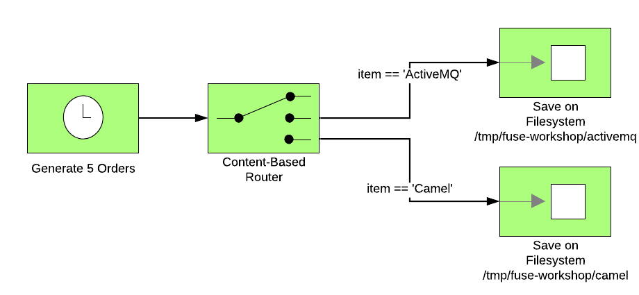
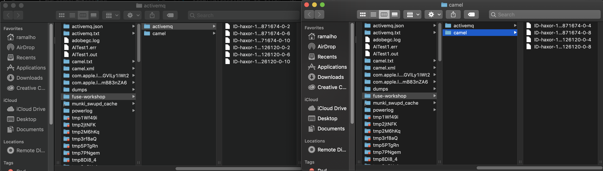
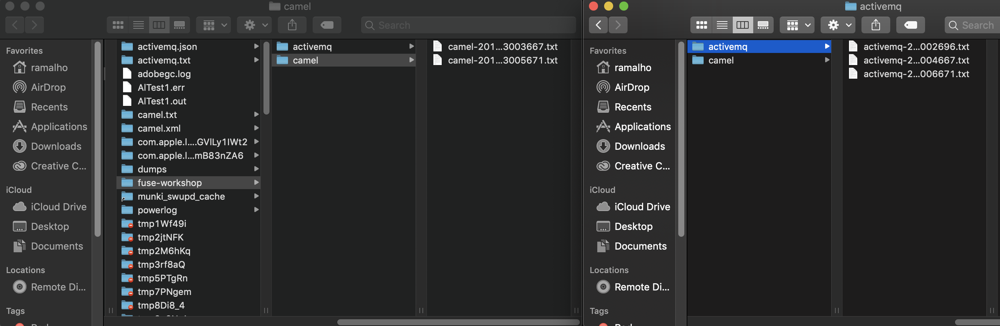
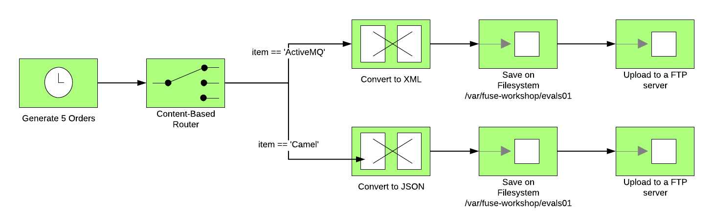
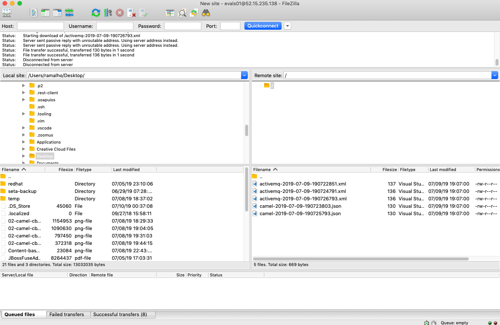

= 02 - Integration with Files and FTP

On this lab, we will explore some basic concepts of Camel, and explore the *file* component and also work with 
basic transformations, transform a Java Object (POJO) in a file with JSON and XML format.

image::../../images/lab02-process-diagram.png[]

Content covered during this lab:

* Content base router pattern 
* XML and JSON transformation 
* File component 
* FTP component 
* Processor 

== Content base router introduction

Content-Base Router (CBR) is a pattern from the Enterprise Integration Pattern. You will use CBR when you need 
to filter some result.

The code below is a CBR sample from the Enterprise Integration Pattern website.

[source,java]
----
from("direct:in")
    .choice()
        .when(header("type").isEqualTo("widget"))
            .to("direct:widget")
        .when(header("type").isEqualTo("gadget"))
            .to("direct:gadget")
        .otherwise()
            .to("direct:other")
----

You will use similar code in this lab. 

== Separating different types of Order

We are continuing to evolve the previous lab. We have five orders being generated automatically by the last lab. 
In each order generated the item description is different, alternating between *ActiveMQ Book* and *Camel Book*.

Let's separate each of these different books with content-based router pattern. But first, let's update the previous router to 
invoke the one that we will be working on this lab.

Add this line to the previous lab: 

    .to("direct:book-to-file");

Now, let's implement the content base router pattern:

[source,java]
----
from("direct:book-to-file")
    .choice()
        .when(simple("${body.item} == 'Camel'"))
            .log("Processing a camel book")
        .otherwise()
            .log("Processing an activemq book");
----

We compare the *item* attribute of the object Order and print a message.

Run and check if both messages *Processing Camel book* and *Processing ActiveMQ book* appear in the log.

image::../../images/02-camel-cbr-01.png[]

== Interacting with Files

https://camel.apache.org/file2.html

Let's use a new *File* component to persist this order on the filesystem. *File* component is powerful and enables us to interact with the file system easily. 

Adjust the router to persist the camel book in the directory */tmp/fuse-workshop/camel* and the activemq book in  */tmp/fuse-workshop/activemq*

See the code below:

[source,java]
----
from("direct:book-to-file")
    .choice()
        .when(simple("${body.item} == 'Camel'"))
            .log("Processing a camel book")
            .convertBodyTo(String.class)
            .to("file:/tmp/fuse-workshop/camel")
        .otherwise()
            .log("Processing an activemq book")
            .convertBodyTo(String.class)
            .to("file:/tmp/fuse-workshop/activemq");
----

The line .convertBodyTo(String.class) is just invoking the Order.class to String method. and after we are saving all files in the filesystem.

Run and check if the directories have files inside and the content of the files.

But wait, look at file names is auto-generated and weird. Let's fix these exploring some parameters of the file component. 

Change the last line as the following:

Camel: 
    
    .to("file:/tmp/fuse-workshop/camel?fileName=camel-${date:now:yyyy-MM-dd-HHmmssSSS}.txt")

ActiveMQ 

    .to("file:/tmp/fuse-workshop/activemq?fileName=activemq-${date:now:yyyy-MM-dd-HHmmssSSS}.txt");

Run and check if the files have the names in the structured defined. 

== Data Transform

https://camel.apache.org/data-format.html

Now, let's take the example before and instead of store everything in *.txt* format, let's transform the Java object in camel body (Order.java). 

Let's transform the Camel type to JSON and the ActiveMQ to XML.

image::../../images/lab02-content-base-router.png[]

To work with Data Format, we have two methods: *marshall()* and *unmarshal()*. 

* *marshall()* we use to convert a Java Bean in other datatype as XML,JSON,CSV..
* *unmarshal()* we use to the opposite when we have a datatype as XML, JSON, CSV and would like to transform in a Java Bean. 

Let's remove the transformation of the body to String and do a proper transformation. To camel items let's transform to JSON and ActiveMQ items to XML. 

Update the route to the following: 

[source,java]
----
from("direct:book-to-file")
    .choice()
        .when(simple("${body.item} == 'Camel'"))
            .log("Processing a camel book")
            .marshal().json()
            .to("file:/tmp/fuse-workshop/camel?fileName=camel-${date:now:yyyy-MM-dd-HHmmssSSS}.json")
        .otherwise()
            .log("Processing an activemq book")
            .marshal().jacksonxml()
            .to("file:/tmp/fuse-workshop/activemq?fileName=activemq-${date:now:yyyy-MM-dd-HHmmssSSS}.xml");
----

Run and check if the files have the correct extensions and if the content is in in the format described.

image::../../images/02-camel-cbr-04.png[]

== FTP Server 

Now, let's do another route to upload those files to an FTP server. 

The FTP server credentials will be provided by the instructor during the class. 

Implement a route that takes all files on camel directory and publishes it in the FTP server. 

The FTP directory must be the */var/fuse-workshop/<your-user>*.  
For evals01, that path will be */var/fuse-workshop/evals01*.

Also, remember to configure the component to *delete the files* before consumed.

The sample for activemq directory it's the following:

[source,java]
----
from("file:/tmp/fuse-workshop/activemq?delete=true")
    .log("uploading activemq orders to ftp")
    .to("ftp://<ftp-user>@<ftp-host>?password=<ftp-password>&localWorkDirectory=<ftp-path>");
----

Do the same with the files on the camel directory.

Rerun the integration and check if the files were uploaded from FTP server and removed from the filesystem. 

Is it all? Yes, it is :-)

=== Processor and Transformation 

But to add some adrenaline to it. Let's change the Order attribute "processed" to true, 
in the case of ActiveMQ books before uploading to the FTP. 

image::../../images/lab02-process-diagram.png[]

One way to do it is by using a Processor. On the Processor, you can have total access to the message and headers being transported on the camel pipeline. 

So let's create a process, capture de object Order on the Camel Body and change the attribute process to *true*.

Open the OrderProcessor.java file, and do the logic to change the attribute processed of Order object.

[source,java]
----
public void process(Exchange exchange) throws Exception {
    Order order = exchange.getIn().getBody(Order.class);
    order.setProcessed(true);
    System.out.println("attributed process changed");
    exchange.getOut().setBody(order);
}
----

And in the route, add the process before the first transformation of ActiveMQ books. 
[source,java]
----
from("direct:book-to-file")
    .choice()
        .when(simple("${body.item} == 'Camel'"))
            .log("Processing a camel book")
            .marshal().json()
            .to("file:/tmp/fuse-workshop/camel?fileName=camel-${date:now:yyyy-MM-dd-HHmmssSSS}.json")
        .otherwise()
            .log("Processing an activemq book")
            .process(new OrderProcessor()) // ADD THIS LINE
            .marshal().jacksonxml()
            .to("file:/tmp/fuse-workshop/activemq?fileName=activemq-${date:now:yyyy-MM-dd-HHmmssSSS}.xml");
----

Run again and check if everything runs without any error. After,  check if the last XML files uploaded have the process attribute is true.

Just as an additional note, if you would like to consume files from FTP and work as a Java Object, instead to use marshal, you 
must use unmarshal(), example:

[source,java]
----
    .log("reading files from ftp")
    .unmarshal().jacksonxml(Order.class) // Transform the file to Java Object
----

