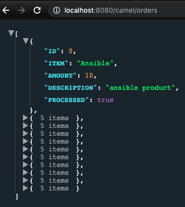
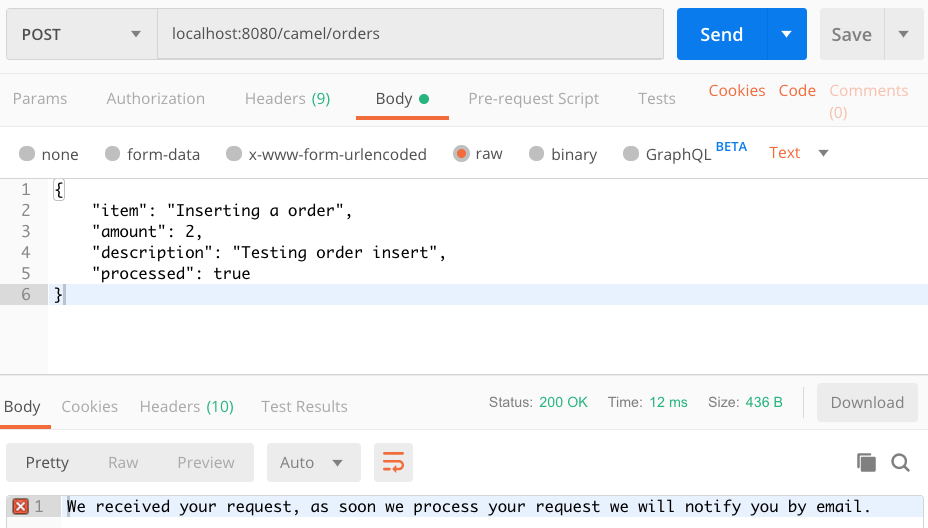

= REST

== Introduction 

REST is key when we talk about integration. On this lab, we are going to explore some basic REST constructions with Red Hat Fuse (Camel). 

image::../../images/lab03-rest-diagram.png[]

We are going to work on 3 REST JSON endpoints: 

* GET - /orders - Retrieve all orders from a database. 
* GET -/orders/{id} - Retrieve a specific order by id 
* POST - /orders - CREATE a order in an async way. 

=== Content covered during this lab

* REST 
* Swagger Generation
* Database
* Wiretap (Async process)
* Messaging

== Creating REST endpoints

Let's create the endpoints needed for this lab. 

Open the *RestRouter.java*. And inside the configure() method, let's declare our first REST endpoint.

=== Get all orders (GET)

[source,java]
----
rest("/orders")
    .get("/")
        .route()
        .log("geting all orders entries from database")
        .endRest()
----

After that, run the project and access http://localhost:8080/camel/orders. 

Every time you hit the HTTP endpoint the message *" getting all orders entries from database"* should appear in the log. It doesn't return anything because nothing was implemented to return. But for now, doesn't worry about it.

image::../../images/lab03-log01.png[]

=== Get order by ID (GET)

[source,java]
----
.get("/{id}")
    .route()
    .log("geting order with id ${header.id} entry from database")
    .endRest()
----

Rerun the application and access the http://localhost:8080/camel/orders/1 endpoint. 

Once again, every time you hit the endpoint, a new message must appear in the logs. 

=== Create a new order (POST)

[source,java]
----
.post("/")
    .route()
    .log("Order received")
    .endRest()
----

To test, Rerun your application and make a POST request to http://localhost:8080/camel/orders with the body:

[source,javascript]
----
{
    "item": "Inserting a order",
    "amount": 2,
    "description": "Testing order insert",
    "processed": true
}
----

== Rest Documentation

The Open API Specification (aka Swagger) is being auto-generated. Take a look in http://localhost:8080/camel/api-doc. 

image::../../images/lab03-api-doc.png[]

If you prefer to see it in a human-readable way, check through the swagger-UI interface http://localhost:8080/webjars/swagger-ui/index.html?url=/camel/api-doc 

image::../../images/lab03-swagger.png[]

You could enrich the documentation adding some descriptions in your code, let's do it:

[source,java]
----
rest("/orders").description("Orders CRUD REST endpoint")
    .get("/").description("Get all orders")
        .route().routeId("all-orders")
        .log("geting all orders entries from database")
        .endRest()
    .get("/{id}").description("Get orders by id")
        .route().routeId("find-by-id")
        .log("geting order with id ${header.id} entry from database")
        .endRest()
    .post("/").type(Order.class).description("Create a new order")
        .route().routeId("create order")
        .log("Order received")
        .endRest();
----

image::../../images/lab03-swagger-documented.png[]

== Boilerplate code

RestSetup.java 

[source,java]
----
restConfiguration()
    .apiContextPath("/api-doc")
    .apiProperty("api.title", "Greeting REST API")
    .apiProperty("api.version", "1.0")
    .apiProperty("cors", "true")
    .apiProperty("base.path", "camel/")
    .apiProperty("api.path", "/")
    .apiProperty("host", "")
    .apiContextRouteId("doc-api")
.component("servlet")
.bindingMode(RestBindingMode.json);
----

Dependencies:

[source,xml]
----
<dependency>
    <groupId>org.webjars</groupId>
    <artifactId>swagger-ui</artifactId>
    <version>3.13.0</version>
</dependency>
<dependency>
    <groupId>org.springframework.boot</groupId>
    <artifactId>spring-boot-starter-web</artifactId>
    <exclusions>
        <exclusion>
            <groupId>org.springframework.boot</groupId>
            <artifactId>spring-boot-starter-tomcat</artifactId>
        </exclusion>
    </exclusions>
</dependency>
<dependency>
    <groupId>org.springframework.boot</groupId>
    <artifactId>spring-boot-starter-undertow</artifactId>
</dependency>
----

== Database

Ok, we have the REST endpoints but it doesn't nothing until now. Let's work on interact with Orders database 
to retrieve relevant order information. 

On this case we will use the camel-SQL component to do it. 

=== Introduction

Interacting with a database is a common need, so it's important to see how simple camel handle it.

To achieve it, we will keep working on the fuse-workshop project. Let's implement a method to retrieve 
all orders from a database.

=== Interacting with database

There are two strings *selectAll* and *selectById* already made for retrieve the properly information from database 
use it on the REST DSL to interact with database. 

All the maven dependencies are already included by you and on the develop environment you will be using a embedded database, 
so don't worry with any installation process.

=== GET all and by ID

[source,java]
----
.get("/").description("Get all orders")
    .route().routeId("all-orders")
    .log("geting all orders entries from database")
    .to(this.selectAll)
    .endRest()

.get("/{id}").description("Get orders by id")
    .route().routeId("find-by-id")
    .log("geting order with id ${header.id} entry from database")
    .to(this.selectById)
    .endRest()
----

Run the project and access the endpoints:

. http://localhost:8080/camel/orders
. http://localhost:8080/camel/orders/1

The response should be like this:

The file *schema.sql* was created to populate the database during the startup. Open it and take a look. 

=== Create a new Order (POST)

To the method post let's do a quick response to the user and do all processing in background.
For it we are going to use the wiretap component to make a copy of the message on the Camel pipeline and 
post it in a JMS queue.

First set a simple text message to return in the body.

[source,java]
----
    .post("/").type(Order.class).description("Create a new order")
        .route().routeId("create order")
        .log("Order received")
        .setBody().simple("We received your request, as soon we process your request we will notify you by email.")
        .endRest();
----

Run the route and do a POST request to http://localhost:8080/camel/orders, you should see the message in the response.

Now, let's tap the body to work with the body async in the background. 

[source,java]
----
    .post("/").type(Order.class).description("Create a new order")
        .route().routeId("create order")
        .log("Order received")
        .wireTap("direct:create-order")
        .setBody().simple("We received your request, as soon we process your request we will notify you by email.")
        .endRest();

    from("direct:create-order")
        .log("processing order async");
----

Run again and check the log to see if the new message *" processing order async "* appeared. 

image::../../images/lab03-post-async.png[]

Now, just to finish the creation of the user async. let's call the SQL to insert.

[source,java]
----
from("direct:create-order")
    .log("processing order async")
    .to(this.insertOrder);
----

image::../../images/lab03-post02.png[]
image::../../images/lab03-post03.png[]
image::../../images/lab03-post04.png[]

[time=10]

== Boilerplate code

To make it works, the following dependencies were added to the project:

    <dependency>
        <groupId>org.hsqldb</groupId>
        <artifactId>hsqldb</artifactId>
        <scope>runtime</scope>
    </dependency>
    <dependency>
        <groupId>org.apache.camel</groupId>
        <artifactId>camel-sql-starter</artifactId>
    </dependency>

For every different base, you should add the equivalent dependency, as an example if you need to interact with MYSQL 
you must add:

    <dependency>
        <groupId>mysql</groupId>
        <artifactId>mysql-connector-java</artifactId>
        <scope>runtime</scope>
    </dependency>

The file *schema.sql* was created to populate the database during the startup. Open it and take a look. 

[time=5]

[type=verification]
Did you see a list with many orders?
