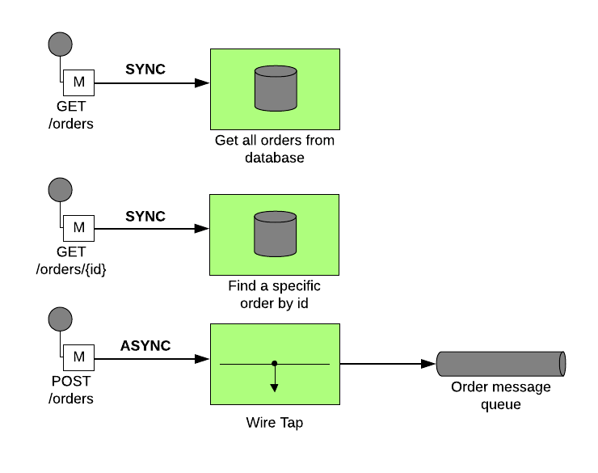
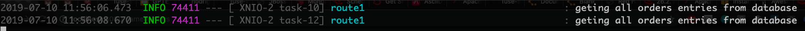
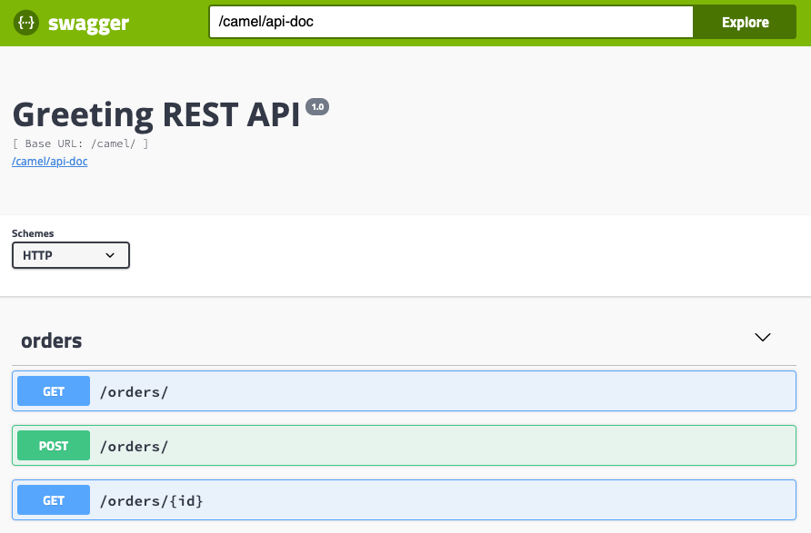

= REST

== Introduction 

REST is key when we talk about integration. On this lab we are going to explore some basic REST constructions 
with Red Hat Fuse (Camel). 

We are going to work on 3 REST JSON endpoints: 

* GET - /orders - Retrieve all orders from a database. 
* GET -/orders/{id} - Retrieve a specific order by id 
* POST - /orders - CREATE a order in an async way. 

=== Content covered during this lab

* REST 
* Swagger Generation
* Database
* Wiretap (Async process)
* Messaging

== Creating REST endpoints

Let's create the endpoints needed for this lab. 

Open the *RestRouter.java*. And inside the configure() method, let's declare our first REST endpoint.

[source,java]
----
rest("/orders")
    .get("/")
        .route()
        .log("geting all orders entries from database")
        .endRest()
----

After that, run the project and access http://localhost:8080/camel/orders. 

Everytime you hit the HTTP endpoint the message "geting all orders entries from database" should appear in the log. It doesn't returning anything 
because we doesn't implement anything, but doesn't worry about it for now. 

To the find order by ID endpoint, let's declare:

[source,java]
----
.get("/{id}")
    .route()
    .log("geting order with id ${header.id} entry from database")
    .endRest()
----

Rerun the application and access the http://localhost:8080/camel/orders/1 endpoint. Once again everytime you hit the endpoint 
a new message must appear in the logs. 

And for last, let's work with the POST method.

[source,java]
----
.post("/")
    .route()
    .log("Order received")
    .endRest()
----

To test, Rerun your application and do a POST request to http://localhost:8080/camel/orders with the body:

[source,javascript]
----
{
    "item": "Inserting a order",
    "amount": 2,
    "description": "Testing order insert",
    "processed": true
}
----

== Rest Documentation

The Open API Specification (aka Swagger) is being auto generated. Take a look in http://localhost:8080/camel/api-doc . 

image::../../images/lab03-api-doc.png[]

If you prefer to see it in a human readable way, check through the swagger-ui interface http://localhost:8080/webjars/swagger-ui/index.html?url=/camel/api-doc 

You could enrich the documentation adding some descriptions in your code, let's do it:

[source,java]
----
rest("/orders").description("Orders CRUD REST endpoint")
    .get("/").description("Get all orders")
        .route().routeId("all-orders")
        .log("geting all orders entries from database")
        .endRest()
    .get("/{id}").description("Get orders by id")
        .route().routeId("find-by-id")
        .log("geting order with id ${header.id} entry from database")
        .endRest()
    .post("/").type(Order.class).description("Create a new order")
        .route().routeId("create order")
        .log("Order received")
        .endRest();
----

image::../../images/lab03-swagger-documented.png[]

=== Boilerplate code

RestSetup.java 

[source,java]
----
restConfiguration()
    .apiContextPath("/api-doc")
    .apiProperty("api.title", "Greeting REST API")
    .apiProperty("api.version", "1.0")
    .apiProperty("cors", "true")
    .apiProperty("base.path", "camel/")
    .apiProperty("api.path", "/")
    .apiProperty("host", "")
    .apiContextRouteId("doc-api")
.component("servlet")
.bindingMode(RestBindingMode.json);
----

Dependencies:

[source,xml]
----
<dependency>
    <groupId>org.webjars</groupId>
    <artifactId>swagger-ui</artifactId>
    <version>3.13.0</version>
</dependency>
<dependency>
    <groupId>org.springframework.boot</groupId>
    <artifactId>spring-boot-starter-web</artifactId>
    <exclusions>
        <exclusion>
            <groupId>org.springframework.boot</groupId>
            <artifactId>spring-boot-starter-tomcat</artifactId>
        </exclusion>
    </exclusions>
</dependency>
<dependency>
    <groupId>org.springframework.boot</groupId>
    <artifactId>spring-boot-starter-undertow</artifactId>
</dependency>
----

== Database

Simple example on how to interact with a database using camel-sql component.

== Introduction

Interacting with a database is a common need, so it's important to see how simple camel handle it.

To achieve it, we will keep working on the fuse-workshop project. Let's implement a method to retrieve 
all orders from a database.

=== Interacting with database

There is a Camel Router class already created for you with the name PersistenceRouter. As the focus here is not test 
if you know how to write SQL code, the SQL is already implemented in a variable called *selectAll*.

Implement a route to interact with the database. Remember to log the interaction in the route.

[time=10]

=== Boilerplate code

To make it works, the following dependencies was added to the project:

    <dependency>
        <groupId>org.hsqldb</groupId>
        <artifactId>hsqldb</artifactId>
        <scope>runtime</scope>
    </dependency>
    <dependency>
        <groupId>org.apache.camel</groupId>
        <artifactId>camel-sql-starter</artifactId>
    </dependency>

For every different base, you should add the equivalent dependency, as an example if you need to interact with MYSQL 
you must add:

    <dependency>
        <groupId>mysql</groupId>
        <artifactId>mysql-connector-java</artifactId>
        <scope>runtime</scope>
    </dependency>

The file *schema.sql* was created to populate the database during the startup. Open it and take a look. 

[time=5]

=== Run your project locally 

    mvn spring-boot:run 
    
After your project spin up

Access with your web browser: 

. http://localhost:8080/camel/orders

[time=3]

[type=verification]
Did you see a list with many orders?
