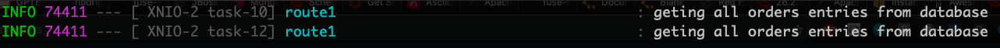

= Lab 3 - REST and Database

REST is key when we talk about integration. On this lab, we are going to explore some basic REST constructions with Red Hat Fuse (Camel).
Interacting with a SQL database. 

image::./images/lab03-rest-diagram.png[]

We are going to work on 3 REST JSON endpoints: 

* GET - /orders - Retrieve all orders from a database. 
* GET -/orders/{id} - Retrieve a specific order by id 
* POST - /orders - CREATE a order in an async way. 

Contents covered during this lab

* REST 
* Swagger Generation
* Database
* Wiretap (Async process)
* Messaging

[time=10]
== Creating REST endpoints

Let's create the endpoints needed for this lab. 

Open the *RestRouter.java*. And inside the configure() method, let's declare our first REST endpoint.

=== Get all orders (GET)

[source,java]
----
rest("/orders")
    .get("/")
        .route()
        .log("geting all orders entries from database")
        .endRest()
----

Run the integration and access the endpoint http://localhost:8080/camel/orders. 

Every time you hit the HTTP endpoint the message *" getting all orders entries from database"* should appear in the log. It doesn't return anything because nothing was implemented to return. But for now, doesn't worry about it.

[type=verification]
Do you see the message *"getting all orders entries from database"* in the logs everytime you hit the /came/oders HTTP endpoint?

=== Get order by ID (GET)

Observe how whe declare the path parameter ID on the URL on this new route.

[source,java]
----
.get("/{id}")
    .route()
    .log("geting order with id ${header.id} entry from database")
    .endRest()
----

Run the integration and access the http://localhost:8080/camel/orders/1 endpoint. 

[type=verification]
Do you see the message *"geting order with id ${header.id} entry from database"* in the logs everytime you hit the /came/oders/1 HTTP endpoint?

=== Create a new order (POST)

Now we will implement the same path as before "/" bot using the HTTP verb POST. 

[source,java]
----
.post("/").type(Order.class)
    .route()
    .log("Order ${body.item} received")
    .endRest()
----

Run the integration and make a POST request to http://localhost:8080/camel/orders with the body:

[source,javascript]
----
{
    "item": "Red Hat Fuse Workshop",
    "amount": 2,
    "description": "Workshop to explore Fuse on springboot",
    "processed": true
}
----

To do this request, use the http://localhost:8080/webjars/swagger-ui/index.html?url=/camel/api-doc[swagger-ui interface]. Details about the API documentation will be covered on the next session.

[type=verification]
Do you see the message *"Workshop to explore Fuse on springboot"* in the logs everytime you hit the /came/oders HTTP (POST) endpoint?

[time=5]
== Rest Documentation

The Open API Specification (aka Swagger) is being auto-generated. Take a look in http://localhost:8080/camel/api-doc. 

image::./images/lab03-api-doc.png[]

If you prefer to see it in a human-readable way, check through the swagger-UI interface http://localhost:8080/webjars/swagger-ui/index.html?url=/camel/api-doc 

image::./images/lab03-swagger.png[]

You could enrich the documentation adding some descriptions in your code, let's do it:

[source,java]
----
rest("/orders").description("Orders CRUD REST endpoint")
    .get("/").description("Get all orders")
        .route().routeId("all-orders")
        .log("geting all orders entries from database")
        .endRest()
    .get("/{id}").description("Get orders by id")
        .route().routeId("find-by-id")
        .log("geting order with id ${header.id} entry from database")
        .endRest()
    .post("/").type(Order.class).description("Create a new order")
        .route().routeId("create order")
        .log("Order received")
        .endRest();
----

image::./images/lab03-swagger-documented.png[]

[type=verification]
Have you been able to access an interface from swagger ui?

[time=5]
== Boilerplate code

RestSetup.java. Using the restConfiguration() method you specify everything about your REST server and swagger doc, take a look:

[source,java]
----
restConfiguration()
    .apiContextPath("/api-doc")
    .apiProperty("api.title", "Greeting REST API")
    .apiProperty("api.version", "1.0")
    .apiProperty("cors", "true")
    .apiProperty("base.path", "camel/")
    .apiProperty("api.path", "/")
    .apiProperty("host", "")
    .apiContextRouteId("doc-api")
.component("servlet")
.bindingMode(RestBindingMode.json);
----

Also, some dependencies are needed:

[source,xml]
----
<!-- Swagger UI -->
<dependency>
    <groupId>org.webjars</groupId>
    <artifactId>swagger-ui</artifactId>
    <version>3.13.0</version>
</dependency>
<!-- REST --> 
<dependency>
    <groupId>org.springframework.boot</groupId>
    <artifactId>spring-boot-starter-web</artifactId>
    <exclusions>
        <exclusion>
            <groupId>org.springframework.boot</groupId>
            <artifactId>spring-boot-starter-tomcat</artifactId>
        </exclusion>
    </exclusions>
</dependency>
<!-- WEB SERVER -->
<dependency>
    <groupId>org.springframework.boot</groupId>
    <artifactId>spring-boot-starter-undertow</artifactId>
</dependency>
----

[time=15]
== Database

Ok, we have the REST endpoints but it doesn't nothing until now. Let's work on interact with Orders database 
to retrieve relevant order information. 

On this case we will use the camel-SQL component to do it. 

Interacting with a database is a common need, so it's important to see how simple camel handle it.

To achieve it, we will keep working with REST resources but interacting with database to get the orders available
and create new ones.

=== Interacting with database

There are three strings *selectAll*, *selectById*, *insertOrder* already made for retrieve/register  properly information from database 
use it on the REST DSL to interact with database. 

All the maven dependencies are already included by you and on the develop environment you will be using a embedded database, 
so don't worry with any installation process.

=== GET all and by ID

[source,java]
----
.get("/").description("Get all orders")
    .route().routeId("all-orders")
    .log("geting all orders entries from database")
    .to(this.selectAll)
    .endRest()

.get("/{id}").description("Get orders by id")
    .route().routeId("find-by-id")
    .log("geting order with id ${header.id} entry from database")
    .to(this.selectById)
    .endRest()
----

Run the integration and invoke the REST endpoints using the swagger-ui interface:

. http://localhost:8080/camel/orders
. http://localhost:8080/camel/orders/1

The response should be like this:

image::./images/lab03-orders-from-database01.png[]

[type=verification]
Are you seeing the Orders from the database now?

The file *schema.sql* was created to populate the database during the startup. Open it and take a look. 

=== Create a new Order (POST)

[source,java]
----
    .post("/").type(Order.class).description("Create a new order")
        .route().routeId("create order")
        .log("Order received")
        .to(this.insertOrder);
        .endRest();
----

Run the integration and make a POST request to http://localhost:8080/camel/orders with the body:

[source,javascript]
----
{
    "item": "Red Hat Fuse Workshop",
    "amount": 2,
    "description": "Workshop to explore Fuse on springboot",
    "processed": true
}
----

[type=verification]
Execute the get all Orders, could you see the new order that you just created?

[time=3]
== Boilerplate code

To make it works, the following dependencies were added to the project:

    <dependency>
        <groupId>org.hsqldb</groupId>
        <artifactId>hsqldb</artifactId>
        <scope>runtime</scope>
    </dependency>
    <dependency>
        <groupId>org.apache.camel</groupId>
        <artifactId>camel-sql-starter</artifactId>
    </dependency>

For every different base, you should add the equivalent dependency, as an example if you need to interact with MYSQL 
you must add:

    <dependency>
        <groupId>mysql</groupId>
        <artifactId>mysql-connector-java</artifactId>
        <scope>runtime</scope>
    </dependency>

The file *schema.sql* was created to populate the database during the startup. Open it and take a look. 

[type=verification]
Do you see a list with many orders?
