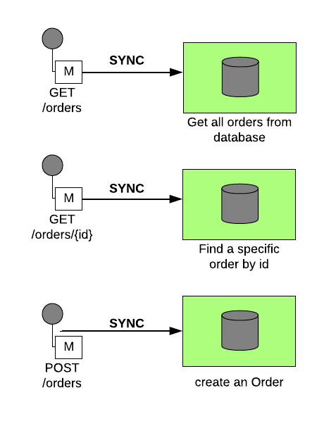
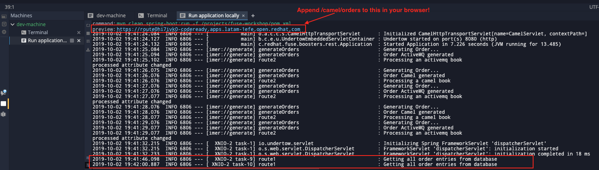
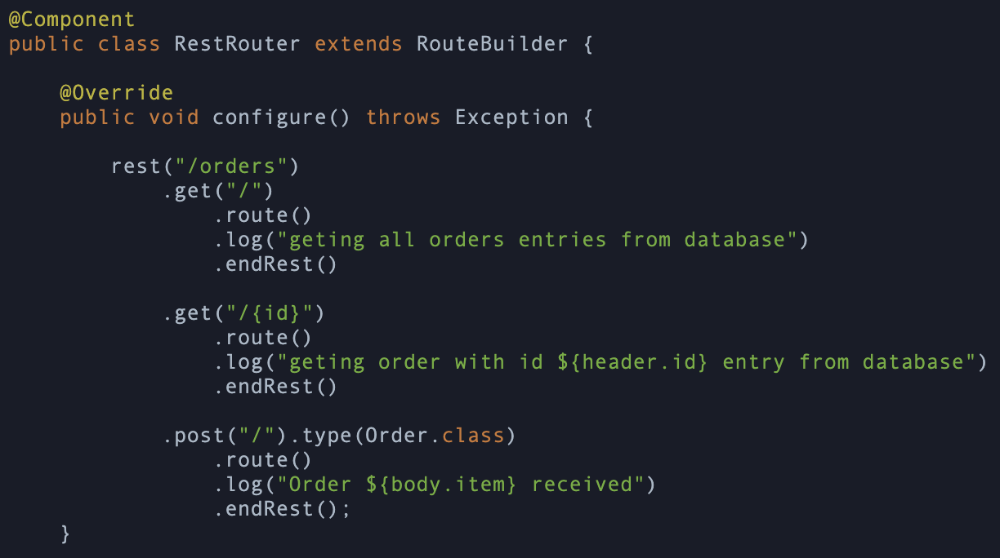
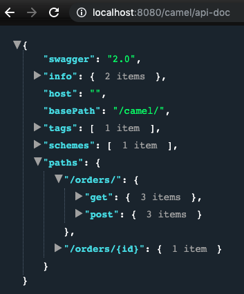
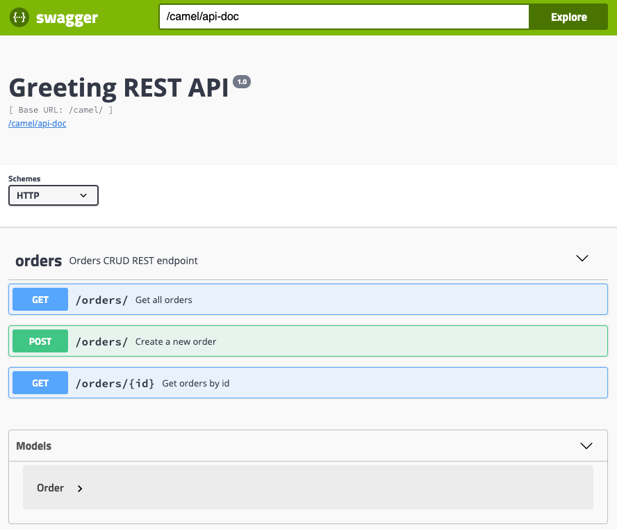
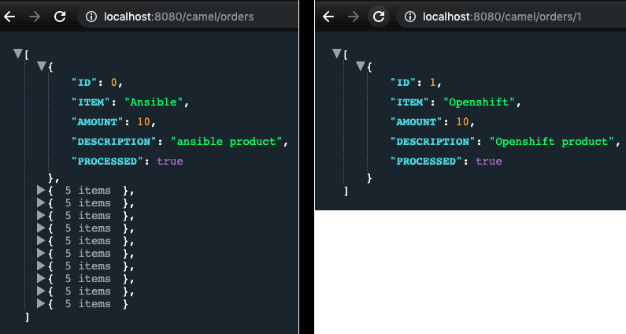

:walkthrough: REST and Database
:codeready-url: https://codeready-codeready.{openshift-app-host}
:openshift-url: {openshift-host}/console
:next-lab-url: https://tutorial-web-app-webapp.{openshift-app-host}/tutorial/fuse-springboot-workshop.git-walkthroughs-04-messaging

= Lab 3 - REST and Database

REST is key when we talk about integration. In this lab, we are going to explore some basic REST integrations with Red Hat Fuse (Camel) interacting with a SQL database.

We are going to work on 3 REST JSON endpoints:

* `GET /orders`
** Retrieve all orders from a database
* `GET /orders/{id}`
** Retrieve a specific order by id
* `POST /orders`
** CREATE a order in an async way

Patterns/components covered during this lab

* REST
* Swagger Generation
* Database
* Wiretap (Async process)
* Messaging

[type=walkthroughResource]
.CodeReady Workspaces
****
* link:{codeready-url}[Console, window="_blank"]
* link:https://developers.redhat.com/products/codeready-workspaces/overview/[Want to know more about CodeReady Workspaces?, window="_blank"]
****

[time=10]
== Creating REST endpoints

Let's create the endpoints needed for this lab.

Open `RestRouter.java`. Inside the `configure(`` method, declare our first REST endpoint.

=== Get all orders (GET)

[source,java]
----
rest("/orders")
    .get("/")
        .route()
        .log("Getting all order entries from database")
        .endRest();
----

Run the integration and access the preview endpoint as shown in your CodeReady Workspaces (append `/camel/orders` to it) terminal (or if running on a local workstation, link:http://localhost:8080/camel/orders[http://localhost:8080/camel/orders, window="_blank"])

Every time you hit the HTTP endpoint the message *" getting all orders entries from database"* should appear in the log. It doesn't return anything yet because nothing has implemented to return to the caller. For now, doesn't worry about it.

[type=verification]
Do you see the message *"getting all orders entries from database"* in the logs everytime you hit the /came/oders HTTP endpoint?

=== Get order by ID (GET)

Observe how we declare the path parameter ID on the URL on this new route.

[source,java]
----
.get("/{id}")
    .route()
    .log("Getting order with id ${header.id} entry from database")
    .endRest();
----

Run the integration again and access the page in the browser as before, except use the URI path `/camel/orders/1`.

[type=verification]
Do you see the message *"Getting order with id 1 entry from database"* in the logs everytime you hit the /camel/orders/1 endpoint?

=== Create a new order (POST)

Now we will implement the same path as before (`/`) but using the HTTP verb POST.

[source,java]
----
.post("/").type(Order.class)
    .route()
    .log("Order ${body.description} received")
    .endRest();
----

The entire class should look like this:

[source,java]
----
rest("/orders")
    .get("/")
        .route()
        .log("geting all orders entries from database")
        .endRest()

    .get("/{id}")
        .route()
        .log("geting order with id ${header.id} entry from database")
        .endRest()

    .post("/").type(Order.class)
        .route()
        .log("Order ${body.description} received")
        .endRest();
----

Access the the URL again, this time without the `/camel/orders` URI.

image::./images/lab03-codeready-server.gif[]

. Click on the *API Swagger page*
. Expand the *POST /orders/* section
. Click *Try it out*
. In the body, paste in the following JSON & click *Execute*

[source,javascript]
----
{
    "item": "Red Hat Fuse Workshop",
    "amount": 2,
    "description": "Workshop to explore Fuse on springboot",
    "processed": true
}
----

[type=verification]
Do you see the message *"Order Workshop to explore Fuse on springboot received"* in the logs everytime you hit the `/camel/orders` HTTP (POST) endpoint?

[time=5]
== Rest Documentation

The Open API Specification (aka Swagger) is being auto-generated. Open the browser to the `/camel/api-doc` endpoint.

If you prefer to see it in a human-readable way, check through the swagger-UI interface with the `/webjars/swagger-ui/index.html?url=/camel/api-doc` endpoint.

image::./images/lab03-swagger.png[]

You could enrich the documentation adding some descriptions in your code, let's do it:

[source,java]
----
rest("/orders").description("Orders CRUD REST endpoint")
    .get("/").description("Get all orders")
        .route().routeId("all-orders")
        .log("Getting all order entries from database")
        .endRest()
    .get("/{id}").description("Get orders by id")
        .route().routeId("find-by-id")
        .log("Getting order with id ${header.id} entry from database")
        .endRest()
    .post("/").type(Order.class).description("Create a new order")
        .route().routeId("create order")
        .log("Order received")
        .endRest();
----

[type=verification]
Have you been able to access an interface from swagger ui? Do you see the updated documentation?

[time=5]
== Boilerplate code

In `RestSetup.java` we use the `restConfiguration()` method to specify everything about the REST server and swagger doc:

[source,java]
----
restConfiguration()
    .apiContextPath("/api-doc")
    .apiProperty("api.title", "Greeting REST API")
    .apiProperty("api.version", "1.0")
    .apiProperty("cors", "true")
    .apiProperty("base.path", "camel/")
    .apiProperty("api.path", "/")
    .apiProperty("host", "")
    .apiContextRouteId("doc-api")
.component("servlet")
.bindingMode(RestBindingMode.json);
----

Also, some dependencies are needed in `pom.xml`:

[source,xml]
----
<!-- Swagger UI -->
<dependency>
    <groupId>org.webjars</groupId>
    <artifactId>swagger-ui</artifactId>
    <version>3.13.0</version>
</dependency>
<!-- REST -->
<dependency>
    <groupId>org.springframework.boot</groupId>
    <artifactId>spring-boot-starter-web</artifactId>
    <exclusions>
        <exclusion>
            <groupId>org.springframework.boot</groupId>
            <artifactId>spring-boot-starter-tomcat</artifactId>
        </exclusion>
    </exclusions>
</dependency>
<!-- WEB SERVER -->
<dependency>
    <groupId>org.springframework.boot</groupId>
    <artifactId>spring-boot-starter-undertow</artifactId>
</dependency>
----

[time=15]
== Database

Now we have the REST endpoints but it doesn't do anything until we tie it into some kind of back-end data store. Let's work on interaction with the orders database to retrieve relevant order information. For this we will use the https://camel.apache.org/sql.html[camel-SQL] component to do it.

Interacting with a database is a common need, so it's important to see how simple it is with Camel.

We will continue working with the same REST resources but adding database interactions to get the orders available and create new ones.

=== Interacting with database

There are three strings (*selectAll*, *selectById*, *insertOrder*) already defined in the `RestRouter` class to retrieve/create information from a database that we will use on the REST DSL to interact with database.

All the maven dependencies are already included for in `pom.xml`. In this lab you will be using an embedded database, so don't worry with any installation process.

=== GET all and by ID

[source,java]
----
.get("/").description("Get all orders")
    .route().routeId("all-orders")
    .log("Getting all order entries from database")
    .to(this.selectAll)
    .endRest()

.get("/{id}").description("Get orders by id")
    .route().routeId("find-by-id")
    .log("Getting order with id ${header.id} entry from database")
    .to(this.selectById)
    .endRest()
----

Run the integration and invoke the REST endpoints using the swagger-ui interface:

. `/camel/orders`
. `/camel/orders/1`

The response should look like this:

[type=verification]
Are you seeing the Orders from the database now?

The file `src/main/resources/schema.sql` was created to populate the database during the startup. Open it and take a look.

=== Create a new Order (POST)

[source,java]
----
    .post("/").type(Order.class).description("Create a new order")
        .route().routeId("create order")
        .log("Order received")
        .to(this.insertOrder)
        .endRest();
----

Run the integration and make a POST request to `/camel/orders` with the following body:

[source,javascript]
----
{
    "item": "Red Hat Fuse Workshop",
    "amount": 2,
    "description": "Workshop to explore Fuse on springboot",
    "processed": true
}
----

[type=verification]
Execute the get all Orders again. Do you see the new order that you just created?

[time=3]
== Boilerplate code

To make it all work, the following dependencies were added to the project's `pom.xml`:

    <dependency>
        <groupId>org.hsqldb</groupId>
        <artifactId>hsqldb</artifactId>
        <scope>runtime</scope>
    </dependency>
    <dependency>
        <groupId>org.apache.camel</groupId>
        <artifactId>camel-sql-starter</artifactId>
    </dependency>

For every different database you want to support, you need to add the equivalent driver dependency. For example, if you need to interact with MySQL, you must add:

    <dependency>
        <groupId>mysql</groupId>
        <artifactId>mysql-connector-java</artifactId>
        <scope>runtime</scope>
    </dependency>
