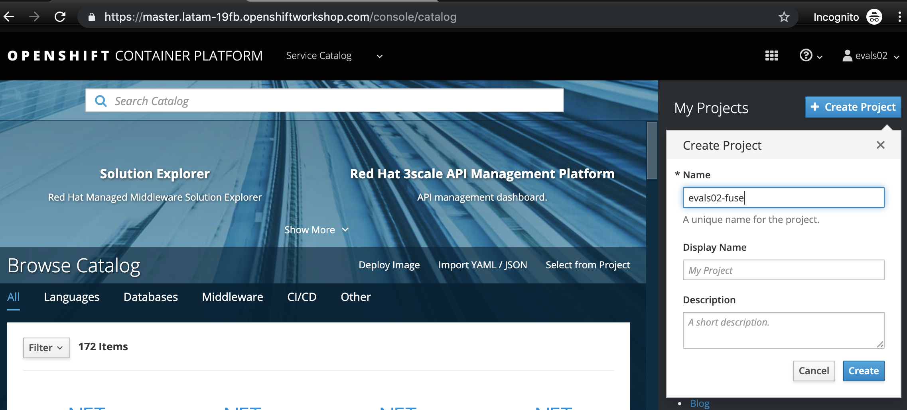
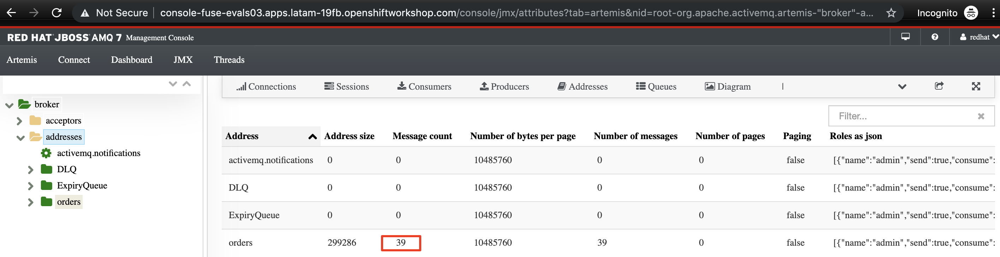

= Lab 4 - Messaging

Messaging makes applications loosely coupled by communicating asynchronously, which also makes the communication more reliable because the two applications do not have to be running at the same time. Messaging makes the messaging system responsible for transferring data from one application to another, so the apps can focus on what data they need to share but not worry so much about how to share it.

Let's create a post and answer a quick response to the user and do all processing in the background.
For it, we are going to use the wiretap component to make a copy of the message on the Camel pipeline and 
post it in a JMS queue.

First set a simple text message to return in the body.

[source,java]
----
.post("/async").type(Order.class).description("Create a new order")
    .route().routeId("create order")
    .log("Order received")
    .setBody().simple("We received your request, as soon we process your request we will notify you by email.")
    .endRest();
----

Run the application and test, calling the POST async method accessing the http://localhost:8080/webjars/swagger-ui/index.html?url=/camel/api-doc[Swagger UI] page.

image::./images/lab04-messaging-01.png[]
image::./images/lab04-messaging-02.png[]

Now, let's tap the body to work with the body async in the background. 

[source,java]
----
    .post("/").type(Order.class).description("Create a new order")
        .route().routeId("create order")
        .log("Order received")
        .wireTap("direct:create-order")
        .setBody().simple("We received your request, as soon we process your request we will notify you by email.")
        .endRest();

    from("direct:create-order")
        .log("processing order async");
----

Run again and check the log to see if the new message *" processing order async "* appeared. 

image::./images/lab03-post-async.png[]

Now, instead of calling the SQL directly, let's send the order to a message broker. 

[source,java]
----
from("direct:create-order")
    .log("sending ${body.item} to JMS queue")
    .to("activemq:queue:orders");
----

Everything should work fine, to simulate the entire flow, let's now do another route to consume and persist this information. This second router could be another system consuming this message, remember that this kind of architecture aims decouple. It could do retries in case of 
failures, scale independent of the consumer/producer, etc.

[source,java]
----
from("activemq:queue:orders")
    .log("received ${body.item} from JMS queue")
    .to(this.insertOrder)
    .to("mock:notify-by-email");
----

Run the application and test, calling the POST async method accessing the http://localhost:8080/webjars/swagger-ui/index.html?url=/camel/api-doc[Swagger UI] page.

Check the logs to see the message being exchanged in the queue. As we are using an embedded broker to test our application without the need to deploy in any place, there isn't a web console, so don't worry with it for now. When we deploy it on Openshift, we take a look in the AMQ console.

image::./images/lab04-messaging-03.png[]

https://access.redhat.com/documentation/en-us/red_hat_amq/7.3/html-single/deploying_amq_broker_on_openshift_container_platform/index

Create the project fuse-<your-user>:

image::./images/lab04-messaging-05.png[] 
image::./images/lab04-messaging-06.png[]
image::./images/lab04-messaging-07.png[]
image::./images/lab04-messaging-08.png[]
image::./images/lab04-messaging-09.png[]

Now that we already have the broker deployed on Openshift, let's use a mechanism that enables we open a 
a TCP tunnel with openshift and work with services as they are in our local machine, it's very useful to 
test resources as database and message broker.

First login at Openshift after choose the project that you created before and after list the pods of this project.

[source,bash]
----
oc login https://master.latam-19fb.openshiftworkshop.com -u evals01@example.com
oc project fuse-evals01
oc get pods    

NAME                 READY     STATUS    RESTARTS   AGE
broker-amq-1-ck9mc   1/1       Running   0          6m
----

Now, that you have the exact name of the pod running AMQ Broker, let's execute the port forward command

[source, bash]
----
    oc port-forward broker-amq-1-ck9mc 61616:61616
----

The output should be like this:

image::./images/lab04-messaging-17.png[]

Now, update your application.properties to use the local broker instead of the embedded one. 
Open the file *application.properties* and uncomment the line below:

[source, bash]
----
# PORT-FORWARD BROKER
activemq.broker.url=tcp://localhost:61616
----

And comment this:

[source, bash]
----
# EMBEDDED BROKER
# activemq.broker.url=vm://localhost
----

Run your integration and create a order using the /order/async HTTP POST method.

Click on the AMQ console URL:

image::./images/lab04-messaging-09.png[]

Choose *AMQ Console* option:

image::./images/lab04-messaging-10.png[]
image::./images/lab04-messaging-12.png[]

On the *Artemis* item on horizontal Menu, select *Address*

image::./images/lab04-messaging-13.png[]

Now that you are seeing the message metrics. Create many (like 10) new orders, using the /order/async HTTP POST method.

Look to the metrics again, you should se some messages on the Message Count column.

image::./images/lab04-messaging-15.png[]

Everything should work fine, to simulate the entire flow, let's now do another route to consume and persist this information. 
This second router could be another system consuming this message, remember that this kind of architecture aims decouple. 
It could do retries in case of failures, scale independent of the consumer/producer, etc.

[source,java]
----
// Consume from the message broker queue
from("activemq:queue:orders")
    .log("received ${body.item} from JMS queue")
    .to(this.insertOrder)
    .to("mock:notify-by-email");
----

Run the integration again and look to the messages on the console after the startup

