:walkthrough: Messaging
:codeready-url: {che-url}
:openshift-url: {openshift-host}
:user-password: Abt7MjWMb8v4ECS
:next-lab-url: https://tutorial-web-app-webapp.{openshift-app-host}/tutorial/fuse-springboot-workshop.git-walkthroughs-05-openshift/

= Lab 4 - Messaging

Asynchronous messaging helps to de-couple applications. Messaging makes the messaging system responsible for transferring data from one application to another, so the apps can focus on what data they need to share but not worry so much about how to share it.

Let's create a RESTful endpoint that returns a quick response to the user, but do all the processing in the background. We are going to use the http://camel.apache.org/wiretap.html[wiretap] component to make a copy of the message in the Camel pipeline and post it in a JMS queue. After we recover from the queue and insert the order into the database, then notify the user by email.

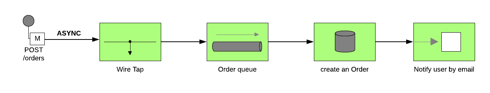

Contents covered during this lab

* ActiveMQ component
* Producing and Consuming messages to a queue
* OpenShift port forward feature
* Use a Local and Remote Broker
* Deploy AMQ broker on OpenShift
* AMQ Console

[type=walkthroughResource,serviceName=codeready]
.CodeReady Workspaces
****
* link:{codeready-url}[Console, window="_blank"]
* link:https://developers.redhat.com/products/codeready-workspaces/overview[Want to know more about CodeReady Workspaces?, window="_blank"]
****

[type=walkthroughResource,serviceName=openshift]
.OpenShift Console
****
* link:{openshift-url}[Console, window="_blank"]
****

[time=5]
== Async router

First set a simple text message to return in the body.

[source,java]
----
.post("/async").type(Order.class).description("Create a new order")
    .route().routeId("create-order-async")
    .log("Async Order received")
    .setBody().simple("We received your request. As soon we process your request we will notify you by email.")
    .endRest();
----

Run the application and test, calling the POST async method accessing the Swagger UI page. Use the following body:

[source,javascript]
----
{
  "item": "Red Hat Integration",
  "amount": 10,
  "description": "Middleware Integration Portfolio",
  "processed": true
}
----

image::./images/lab04-messaging-01.png[]

Now, let's wiretap the body to work with the body async in the background.

[source,java]
----
    .post("/async").type(Order.class).description("Create a new order")
        .route().routeId("create-order-async")
        .log("Order received")
        .wireTap("direct:create-order")
        .setBody().simple("We received your request. As soon we process your request we will notify you by email.")
        .endRest();

    from("direct:create-order")
        .log("processing order async");
----

Run again and check the log to see if the new message *" processing order async "* appeared.

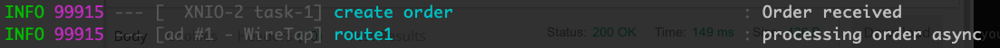

Now, instead of calling the SQL directly, let's send the order to a message broker.

[source,java]
----
from("direct:create-order")
    .log("sending ${body.item} to JMS queue")
    .to("activemq:queue:orders");
----

Run the application and test, calling the POST async method accessing the Swagger UI page.

Check the logs to see the messages exchanged in the queue. As we are using an embedded broker to test our application without the need to deploy in any place, there isn't a web console, so don't worry with it for now. When we deploy it on OpenShift, we'll take a look in the AMQ console.

image::./images/lab04-messaging-03.png[]

[type=verification]
Do you see the message  *"processing order async"* in the logs when you create a new Order?

[time=15]
== Using an AMQ broker on OpenShift remotely

Create the project `{user-username}-fuse`. The images examples are using `evals02`, but *you must* use `{user-username}`.

. Go to the link:{openshift-host}/console[OpenShift Console, window="_blank"]
. Click on create project button & enter `{user-username}-fuse` as the project name, then click *Create*
+
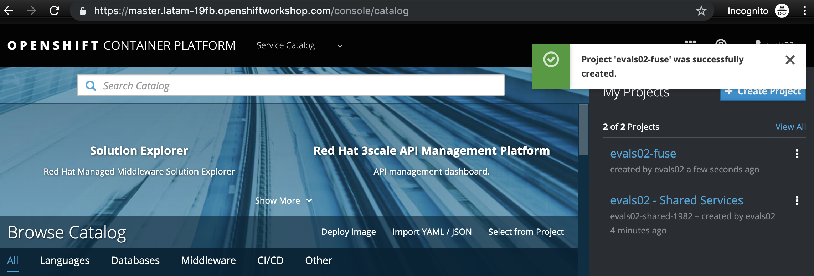
. Select the project to enter it
+
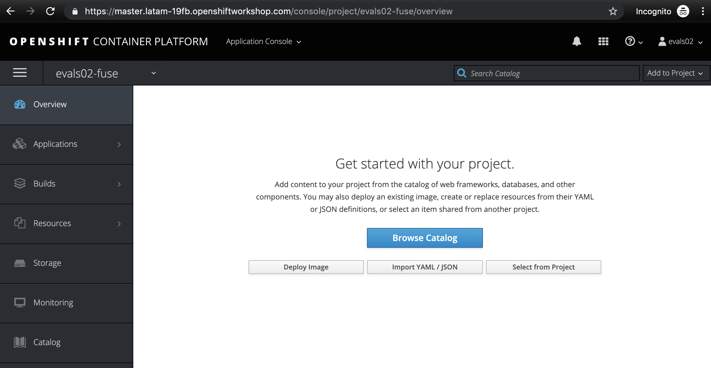
. In the *Search Catalog* box at the top, search for *AMQ Broker 7.4* & select the *Red Hat AMQ Broker 7.4 (Ephemeral, no SSL)* option
+
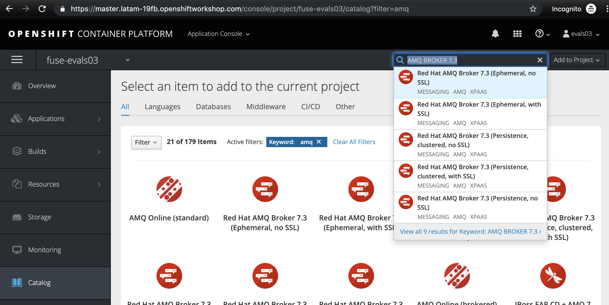
. Fill the fields *AMQ Username* & *AMQ Password* with the value *redhat*, then click *Create* at the bottom of the screen, then *Create* again at the binding screen
+
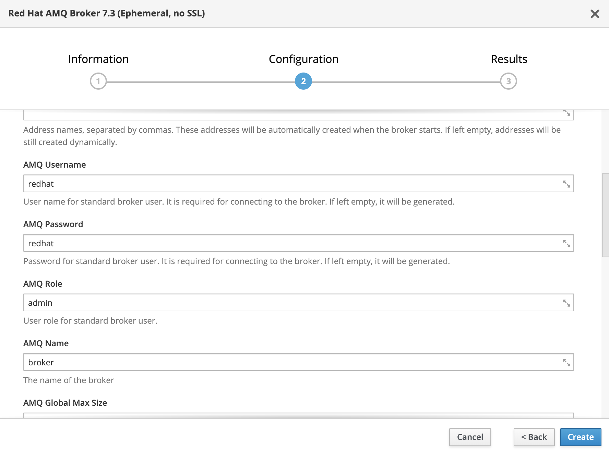
. If your project was provisioned correctly, you would see a screen like this:
+
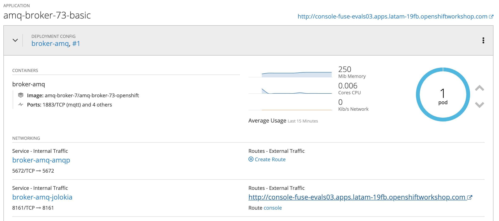

Now that the broker is deployed on OpenShift, we can use a mechanism that enables us to open a connection with OpenShift. This will enable us to consume services deployed on OpenShift from our local machine/CodeReady workspace. This is useful for resources like databases & message brokers.

Login to OpenShift on the terminal, choose our `{user-username}-fuse` project, & list the pods. *NOTE: The actual name of the pods that show up will be different than what is shown here.*

[source,bash,subs="attributes"]
----
oc login {openshift-url} -u {user-username} -p {user-password}
oc project {user-username}-fuse
oc get pods

NAME                 READY     STATUS    RESTARTS   AGE
broker-amq-1-ck9mc   1/1       Running   0          6m
----

Now you have the exact name of the pod running AMQ Broker. Let's execute the port-forward command. This will forward port `61616` (the port the broker listens on) to the local machine at the same port. *Make sure you use the name from the output of your command, not the name shown here!*

[source,bash]
----
    oc port-forward broker-amq-1-ck9mc 61616:61616
----

The output should look like this:

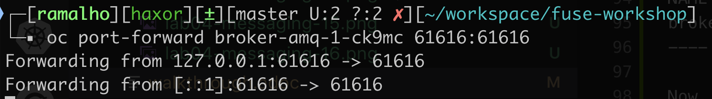

{empty} +

Now, update your `src/main/resources/application.properties` file to use the local broker (which is just forwarded to the actual broker running on OpenShift) instead of the embedded one. Open the `src/main/resources/application.properties` file and uncomment the line below:

[source, bash]
----

# PORT-FORWARD BROKER
activemq.broker.url=tcp://localhost:61616

----

And comment out this line:

[source, bash]
----

# EMBEDDED BROKER
# activemq.broker.url=vm://localhost

----

Run your integration again, creating an order using the `/order/async` HTTP POST method.

Click on the AMQ console URL:

{empty} +

Choose the *Management Console* option:

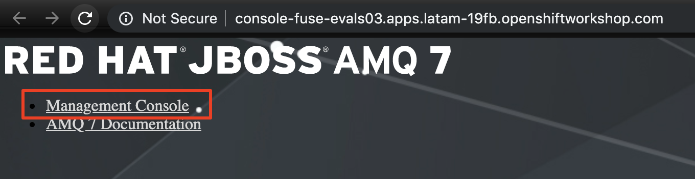

Use `redhat` as the username & password

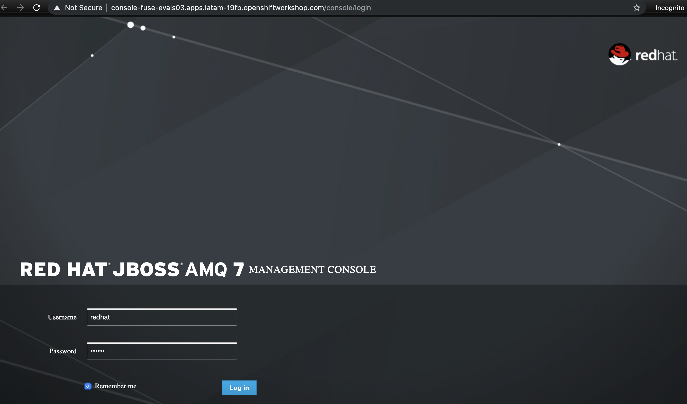

{empty} +

On the *Artemis* item on horizontal Menu, select *Addresses*

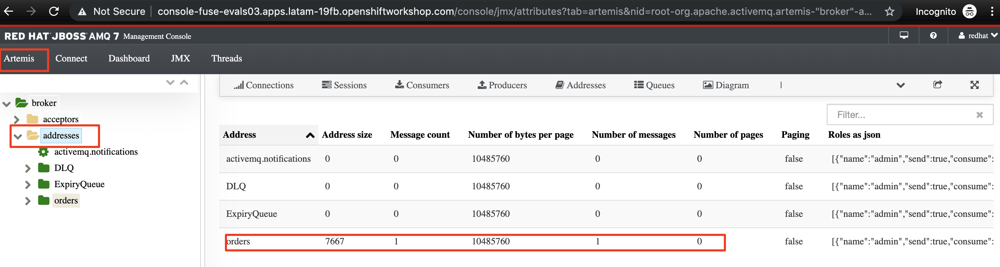

{empty} +

Now that you see the message metrics. Create many (like 10) new orders, using the `/order/async` HTTP POST method.

Look to the metrics again, you should se some messages on the Message Count column.

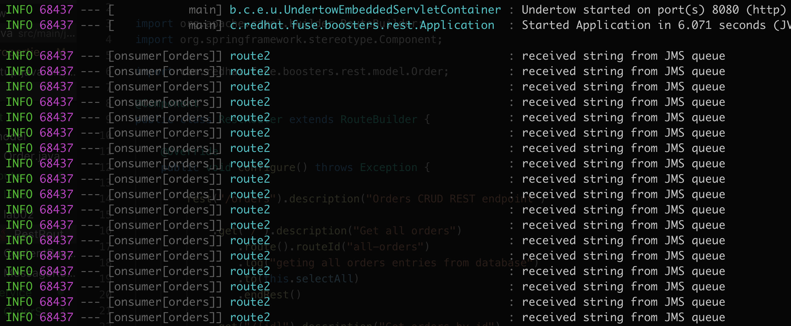

{empty} +

Everything should be working fine. To simulate the entire flow, let's create another route to consume from the queue and persist this information in the database. This second route could be another system consuming this message. Remember that this kind of architecture aims to decouple applications from one another. It could even perform retries in case of failures, scale independently of the consumer/producer, etc.

[source,java]
----
// Consume from the message broker queue
from("activemq:queue:orders")
    .log("received ${body.item} from JMS queue")
    .to(this.insertOrder)
    .to("mock:notify-by-email");
----

Re-run the integration and look to the messages on the console after the startup. The message count from the AMQ7 dashboard should alternate quickly between `0` & `1`.
