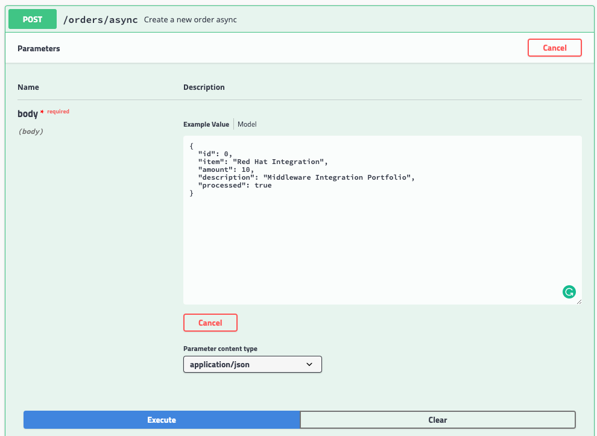

= Messaging 

Messaging makes applications loosely coupled by communicating asynchronously, which also makes the communication more reliable because the two applications do not have to be running at the same time. Messaging makes the messaging system responsible for transferring data from one application to another, so the apps can focus on what data they need to share but not worry so much about how to share it.

Let's create a post and answer a quick response to the user and do all processing in the background.
For it, we are going to use the wiretap component to make a copy of the message on the Camel pipeline and 
post it in a JMS queue.

First set a simple text message to return in the body.

[source,java]
----
.post("/async").type(Order.class).description("Create a new order")
    .route().routeId("create order")
    .log("Order received")
    .setBody().simple("We received your request, as soon we process your request we will notify you by email.")
    .endRest();
----

Run the application and test, calling the POST async method accessing the http://localhost:8080/webjars/swagger-ui/index.html?url=/camel/api-doc[Swagger UI] page.

image::./images/lab04-messaging-02.png[]

Now, let's tap the body to work with the body async in the background. 

[source,java]
----
    .post("/").type(Order.class).description("Create a new order")
        .route().routeId("create order")
        .log("Order received")
        .wireTap("direct:create-order")
        .setBody().simple("We received your request, as soon we process your request we will notify you by email.")
        .endRest();

    from("direct:create-order")
        .log("processing order async");
----

Run again and check the log to see if the new message *" processing order async "* appeared. 

image::./images/lab03-post-async.png[]

Now, instead of calling the SQL directly, let's send the order to a message broker. 

[source,java]
----
from("direct:create-order")
    .log("sending ${body.item} to JMS queue")
    .to("activemq:queue:orders");
----

Everything should work fine, to simulate the entire flow, let's now do another route to consume and persist this information. This second router could be another system consuming this message, remember that this kind of architecture aims decouple. It could do retries in case of 
failures, scale independent of the consumer/producer, etc.

[source,java]
----
from("activemq:queue:orders")
    .log("received ${body.item} from JMS queue")
    .to(this.insertOrder)
    .to("mock:notify-by-email");
----

Run the application and test, calling the POST async method accessing the http://localhost:8080/webjars/swagger-ui/index.html?url=/camel/api-doc[Swagger UI] page.

Check the logs to see the message being exchanged in the queue. As we are using an embedded broker to test our application without the need to deploy in any place, there isn't a web console, so don't worry with it for now. When we deploy it on Openshift, we take a look in the AMQ console.

image::./images/lab04-messaging-03.png[]

