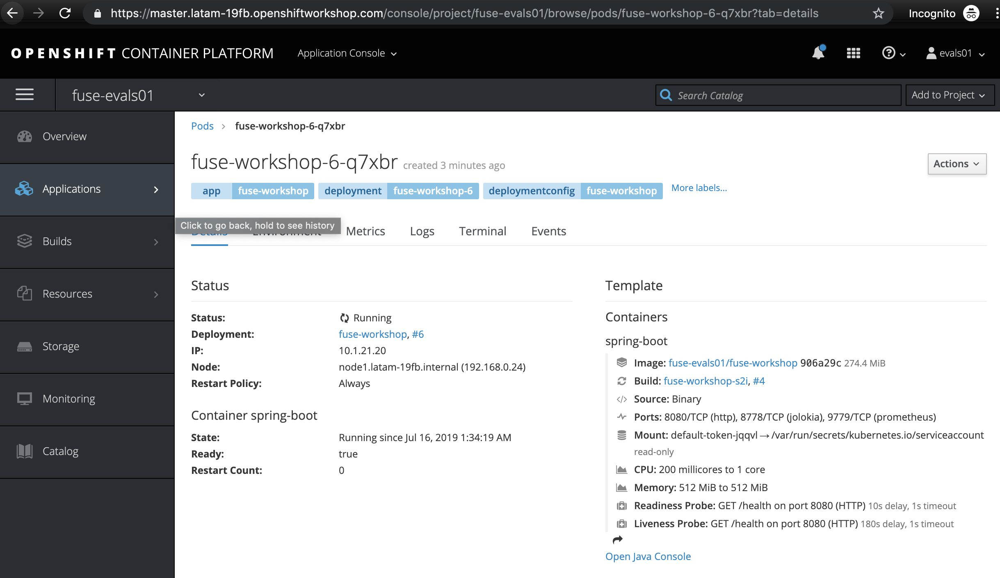
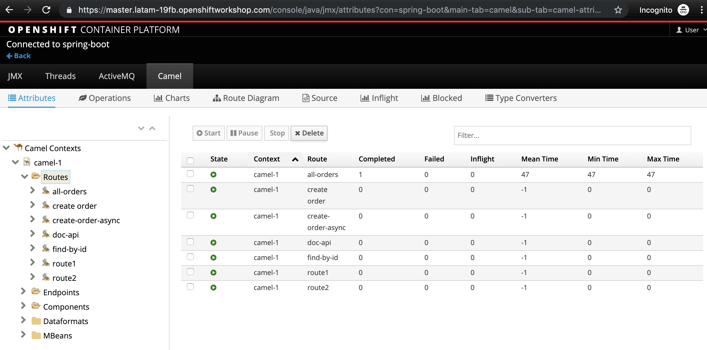
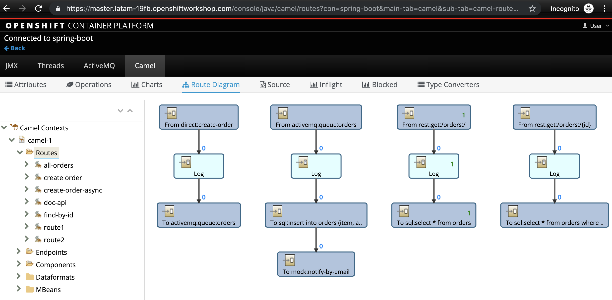
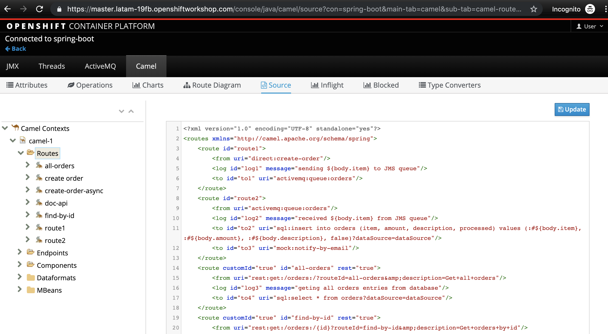
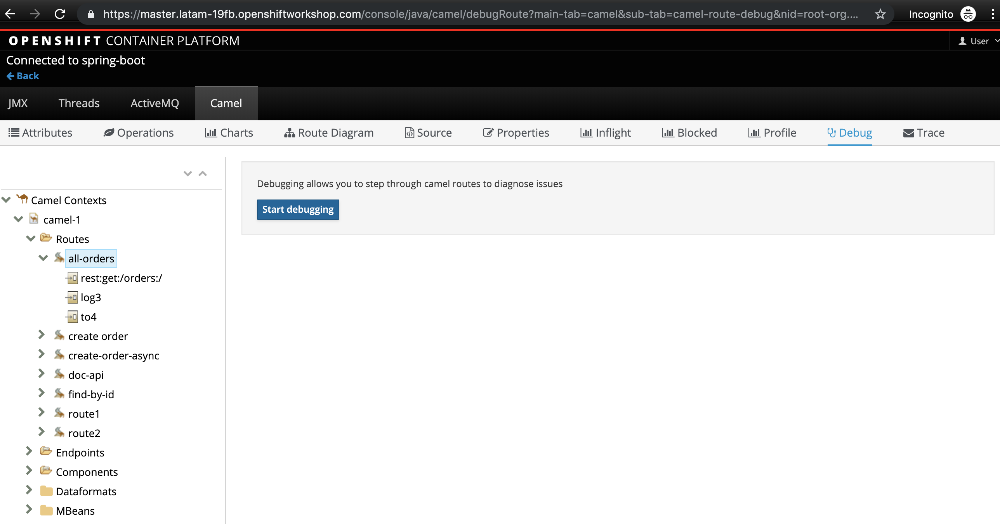
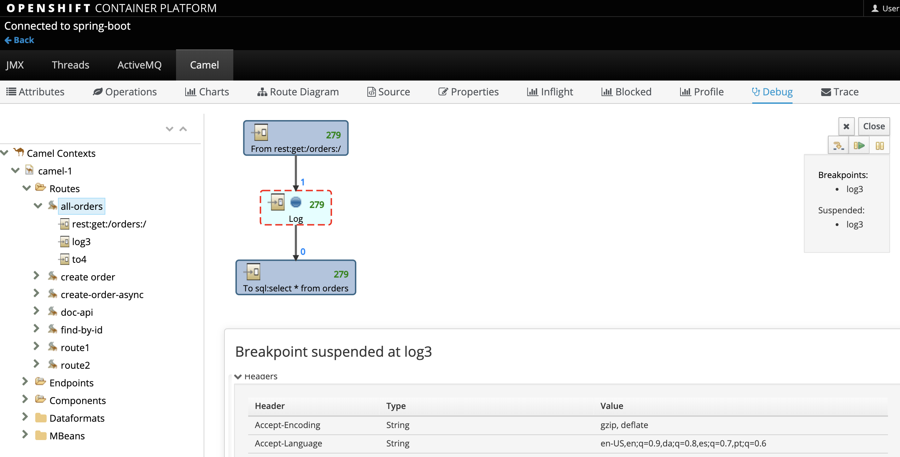
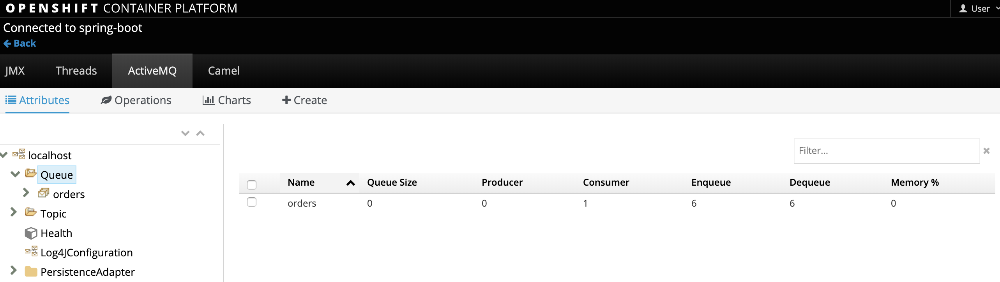

:walkthrough: Publish to Openshift 
:codeready-url: https://codeready-codeready.{openshift-app-host}
:openshift-url: {openshift-host}/console

= Lab 5 - Publish to Openshift 

There are several ways to deploy an application into Openshift. Directly from the git repository using S2I, from the local machine using binary deployment or from a Docker image.

On this lab, we will use the binary deployment option, uploading the code directly from our machine to Openshift server.
For it works, we will need the `oc` client working in our local machine.

[type=walkthroughResource]
.CodeReady Workspaces
****
* link:{codeready-url}[Console, window="_blank"]
****

****
* link:https://developers.redhat.com/products/codeready-workspaces/overview/[Want to know more about Openshift CodeReady Workspace ?, window="_blank"]
****

[type=walkthroughResource]
.Openshift Console
****
* link:{openshift-url}[Console, window="_blank"]
****

[time=5]
== Database MYSQL provision

First, to work with the MYSQL database in production, we have to deploy it. 

Find for MYSQL in the catalog:

image::./images/lab05-mysql-01.png[]

Fill *user, password and admin-password* as *redhat*

image::./images/lab05-mysql-02.png[]

If everything worked, you see a screen like this.

image::./images/lab05-mysql-03.png[]

[time=15]
== Application deploy into Openshift using Binary Deployment

First login into Openshift:

    oc login {openshift-host} -u evals01@example.com -p Password1

Once that we are logged in, and in the specific project, let's do the deploy.

    mvn fabric8:deploy -Popenshift -Dspring.profiles.active=prod

It can take a while, depending on your network performance. 

The *fabric8:deploy* uses the oc client authentication under the hood. So it explains all the dark magic during this process. 

It's important to mention that it uses a binary deployment, but you can use the strategy that you want. 

After fabric8:deploy, take a look in the target field inside the project, to be more specific
look into: target/docker/fuse-workshop/latest/build.

Look that we are using the Broker on Openshift also the MYSQL database, all of the production data 
is on the *application-prod.properties* and we are activating this profile with the parameter:

    -Popenshift -Dspring.profiles.active=prod

Open the Java Console, and check the metrics available. 
Also, take a look at the Diagram.

Another point is the feature of fabric8 that could manipulate Kubernetes file, take a look 
of *deployment.yaml* file. 

Fabric8 will inject this content inside of the final DeploymentConfig of Openshift. 

[time=10]
== Fuse Java Console 

Fuse has a web console, that enables us to see some data flowing trough the route, 
threads, messaging and also some debug. 

The console is based on the open-source project Hawtio, and explore all the JMX exposed metrics 
of Red Hat Fuse.

Click on the blue circle to access the pod of the integration, after click on *Open Java Console*.

Select Routers on the side menu and look for the statistics changing. If you would like to generate 
some data, capture the URL of list all orders as an example and do the following script 
in your shell:

    while(true); do curl...; sleep 1; done

It will do one request per sec, so you have some data to see on the console.

Now, click on *Route Diagram* feature:

You will see the route in a more human-readable way, and the count of requests flowing by the routes. 

The source code as XML:

Let's try to do some debug, select the *all-orders* on the side menu and click on 
*Start debugging*.

Now, a double click on Log step. A breakpoint should appear on the box. 

Make a request to get all the orders. Could be using the Swagger UI.

Now, let's close the debug. Otherwise, it will stay stuck until a timeout in every request. 

If you are using an embedded broker, as we are using on the beginning of the labs, 
here you can see some metrics of this local broker. 

== Application deploy into Openshift using S2I

[type=verification]
Did you navigate through the Fuse Console?
