:walkthrough: Publish to Openshift
:codeready-url: https://codeready-codeready.{openshift-app-host}
:openshift-url: {openshift-host}/console
:user-password: openshift

= Lab 5 - Publish to OpenShift

There are several ways to deploy an application into OpenShift

. Directly from the git repository using S2I
. From the local machine using binary deployment
. From a Docker image

For this lab we will use the binary deployment option (#2 above), uploading the code directly from our machine to OpenShift. For it to work, we will need the `oc` client working in our local machine.

[type=walkthroughResource,serviceName=codeready]
.CodeReady Workspaces
****
* link:{codeready-url}[Console, window="_blank"]
* link:https://developers.redhat.com/products/codeready-workspaces/overview[Want to know more about CodeReady Workspaces?, window="_blank"]
****

[type=walkthroughResource,serviceName=openshift]
.OpenShift Console
****
* link:{openshift-url}[Console, window="_blank"]
****

[type=walkthroughResource]
.Fabric8 Maven Plugin
****
* link:https://maven.fabric8.io[Fabric8 Maven Plugin, window="_blank"]
****

[time=5]
== MySQL Database provisioning

First, to work with the MySQL database in production, we have to deploy/provision it.

. Go to the link:{openshift-host}/console[OpenShift Console, window="_blank"]
. In the *Search Catalog* box at the top, search for *mysql* & select the *MySQL (Ephemeral)* option

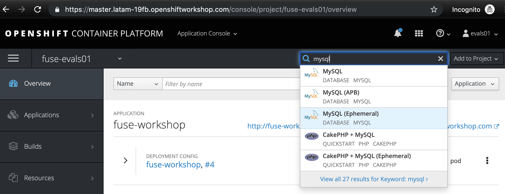

Fill *MySQL Connection Username, MySQL Connection Password, & MySQL root user Password* as *redhat* and click *Next*, followed by *Create* on the binding screen

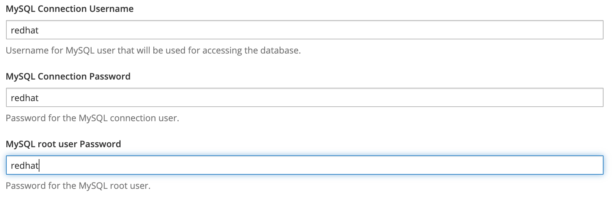

If everything provisioned correctly, you will see a screen like this

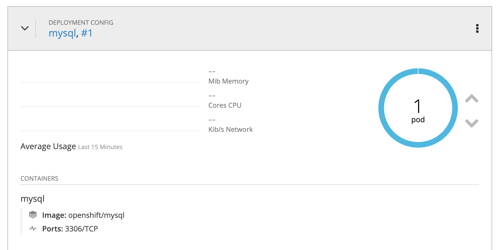

== AMQ provisioning 

[source,yaml]
----
apiVersion: broker.amq.io/v2alpha4
kind: ActiveMQArtemis
metadata:
  name: amq-broker
  application: amq-broker
  namespace: user1
spec:
  deploymentPlan:
    size: 1
    image: >-
      registry.redhat.io/amq7/amq-broker@sha256:a6a2fd548f4e89151a8e7d4bacb7380d0076bbd1b1f5bc5555f2e95e19e1441f
    requireLogin: false
    persistenceEnabled: false
    journalType: nio
    messageMigration: false
    jolokiaAgentEnabled: false
    managementRBACEnabled: true
  adminUser: redhat
  adminPassword: redhat
  console:
    expose: true
----

[time=15]
== Application deployment onto OpenShift using Binary Deployment

Let's setup the `oc` plugin

[source,bash]
----
./oc-setup.sh
----

Login into OpenShift (if you aren't already):

[source,bash,subs="attributes+"]
----
oc login -u {user-username} -p {user-password} https://$KUBERNETES_SERVICE_HOST:$KUBERNETES_SERVICE_PORT --insecure-skip-tls-verify=true
----

Enter in your project

[source,bash,subs="attributes+"]
----
oc project {user-username}
----

Once logged in, right click on the `fuse-workshop` project & choose *Commands -> Deploy (1) -> Deploy to Openshift*. It may take a few minutes depending on your network performance.

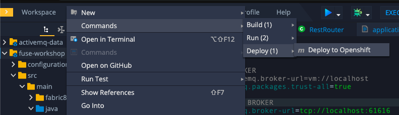

The `fabric8:deploy` maven goal uses the oc client authentication under the hood. It also uses a binary deployment, meaning it builds your application binary locally and sends that to OpenShift to "wrap" in a container image & deploy.

After `fabric8:deploy`, take a look in the target folder inside the project. More specifically, look at `target/docker/fuse-workshop/latest/build`. This shows the source of the container that was built.

After the deployment completes you will see that the application is using both the AMQ Broker & the MySQL database deployed on OpenShift. All of the production configuration data is in the `src/main/resources/application-prod.properties` file and we are activating this profile during the deployment within in `src/main/fabric8/deployment.yml` config file. Fabric8 will inject this content inside of the final DeploymentConfig when deploying to Openshift.

[time=10]
== Fuse Java Console

Fuse has a web console that enables us to see some data flowing trough the routes, threads, messaging and also to do some debugging. The console is based on the open-source project Hawtio, and explore all the JMX exposed metrics
of Red Hat Fuse.

. In the *Search Catalog* box at the top, search for *fuse console* & select the *Red Hat Fuse 7.4 Console* (*NOT* the one that has the *(cluster)* appendix) option
+
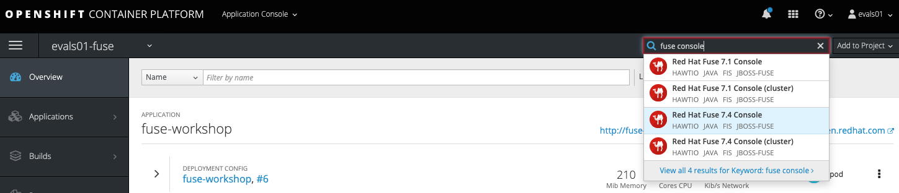
. Select all the defaults, clicking *Next* through all the sections & finally clicking *Create*
. Wait for provisioning to finish
. When provisioning has finished, you should see (the URL will be different for you)
+
image::./images/lab05-fuse-console-new-01.png[]
. Click the link. This will open up the fuse console.
. If prompted, log in with username `{user-username}` & password `{user-password}`
. Once logged in you will see the homepage. You should also see your application registered
+
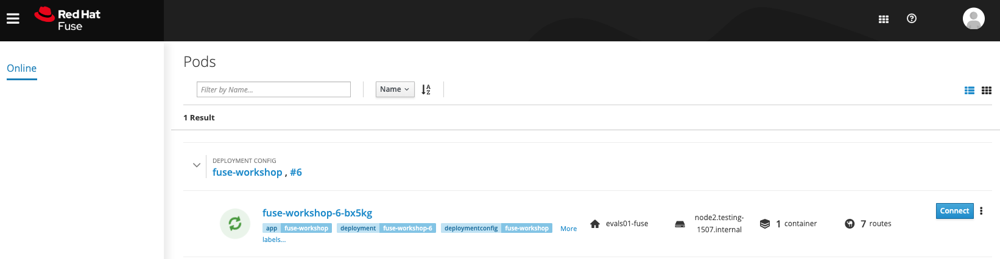
. Click the *Connect* button to connect the console to your running application
+
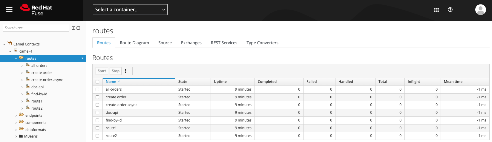
. Select `Routes` on the side menu and look for the statistics changing. If you would like to generate some data, capture the URL of list all orders as an example and do the following script in your terminal:

[source,bash,subs="attributes+"]
----
while(true); do curl http://fuse-workshop-{user-username}-fuse.{openshift-app-host}/camel/orders; sleep 1; done
----

. It will make one request per second, so you have some data to see on the console. You should see the *Completed* number on the *all-orders* route increase.
+
image::./images/lab05-fuse-console-new-05.png[]

. Now, click on *Route Diagram*. You will see the route in a more human-readable way, and the count of requests flowing through the routes.
+
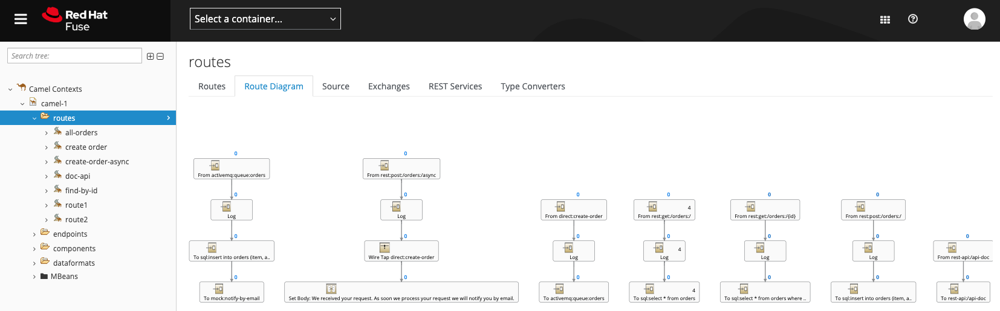

. Click the *Source* tab. This will show the route source code as XML:
+
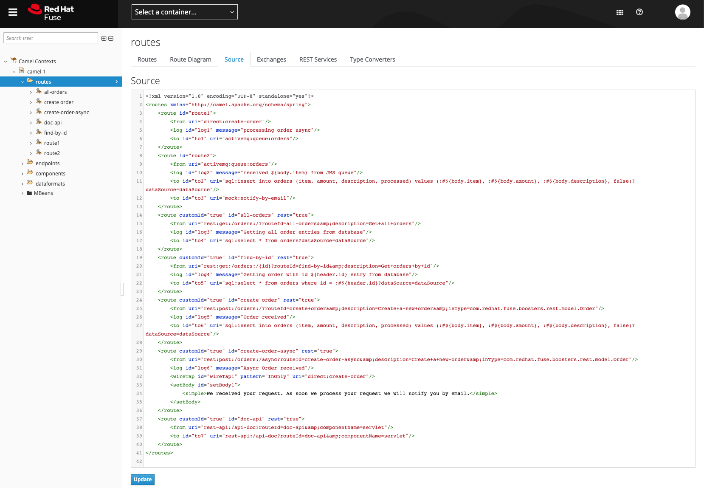

. Let's try to do some debugging
.. Select the `all-orders` route on the side menu
.. Click on the *Debug* tab

+
image::./images/lab05-fuse-console-new-08.png[]
.. Click on *Start debugging*
.. Double-click on the `Log` step. A breakpoint should appear on the box.

+
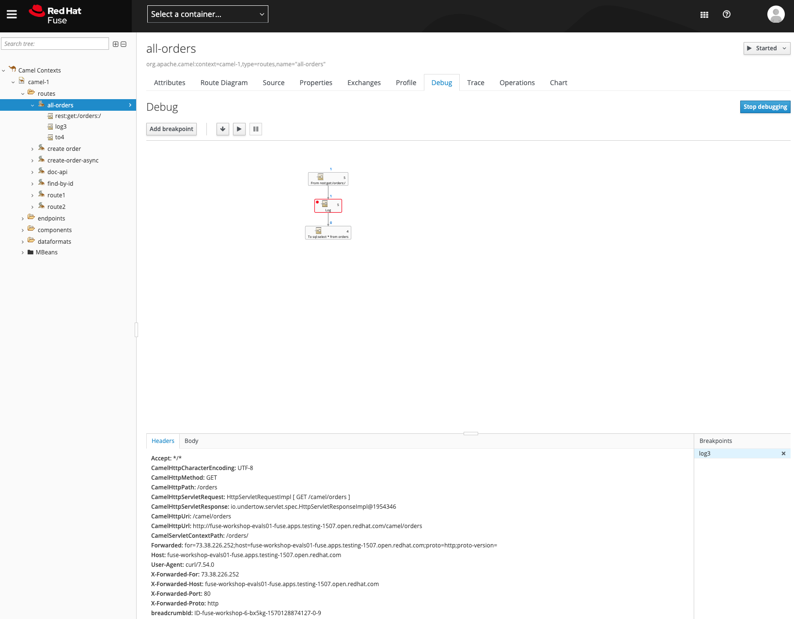

Make another request to get all the orders. You should see a window appear with all the header & body information of the message within the exchange. Now, let's close the debug by clicking *Stop debugging* in the upper-right corner. Otherwise, it will stay stuck until a timeout in every request.

== Application deployment on OpenShift using S2I

Binary deployment is effective when you are doing a lot of changes and do not like to commit to see the results. A very common practice is to deploy the application automatically on each commit. Also s2i is more often used inside CICD pipelines.

Let's deploy the same application but using the S2I strategy.

. In the *Search Catalog* box at the top, search for *jdk* and select *Red Hat OpenJDK 8* in the results.
+
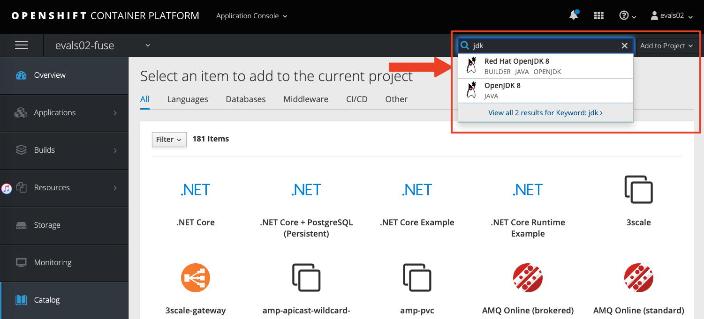
. On the following screen just select *next*.
+
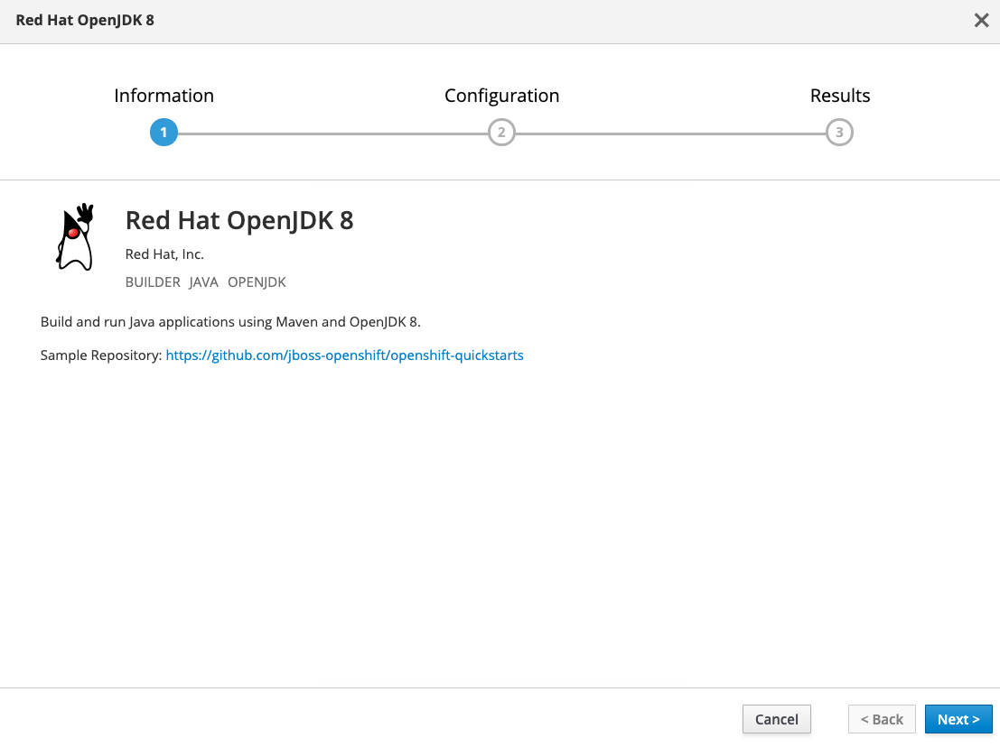
. Input `workshop` as the Application Name and *click on advanced options.*
+
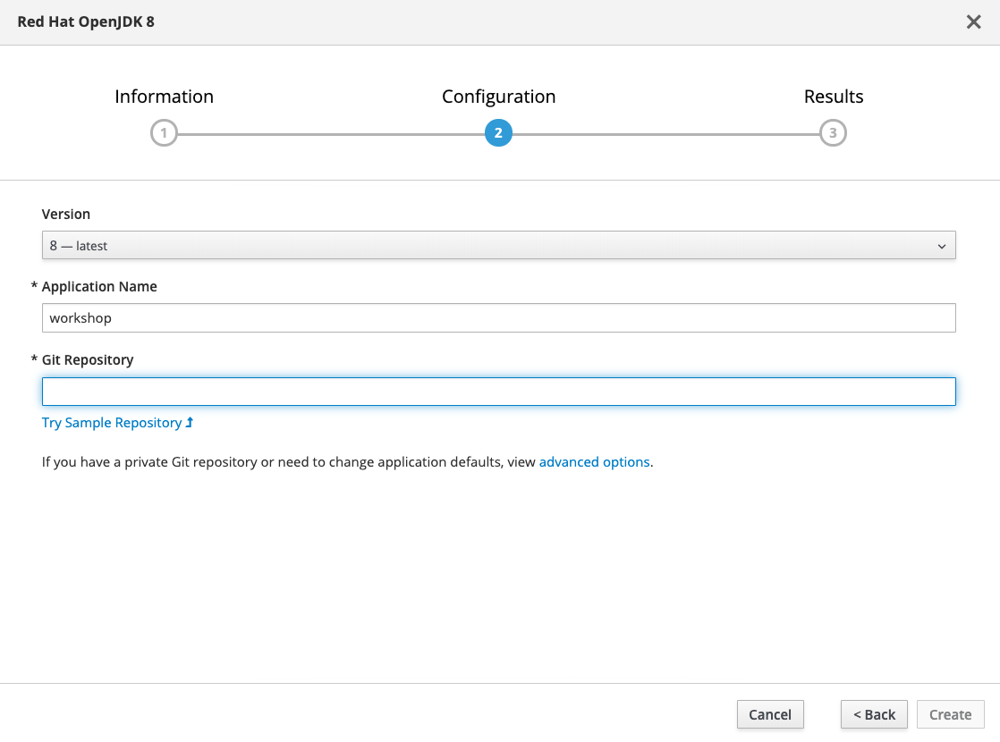
. On the field *Git Repository URL* input `https://github.com/hodrigohamalho/fuse-workshop.git`
. On the field *Git Reference*, input *labs-complete*.
+
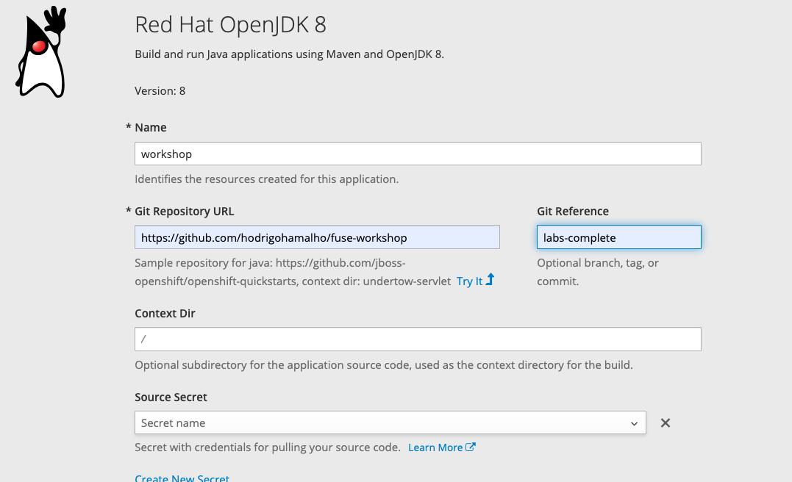
. Leave all the other defaults & click *Create* at the bottom of the screen
. Wait for the build and deployment to complete
.. This will instruct OpenShift to pull the `labs-complete` branch, build it, create a container image, & deploy that image to OpenShift
... When everything is complete you should be able to see it running in the link:{openshift-url}[OpenShift Console, window="_blank"].
+
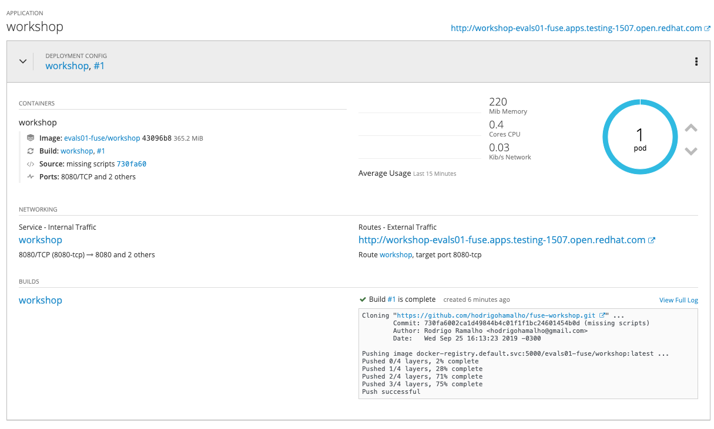
